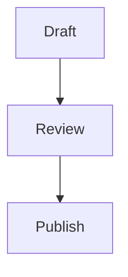

# notionparallax.co.uk blog

This is the repo behind <http://notionparallax.co.uk/>.

## Mermaid Diagrams

Mermaid rendering is enabled site-wide from a single integration point in
`_layouts/default.html`, which includes `_includes/mermaid.html`.

The loader pulls Mermaid from jsDelivr using `@latest` and only runs on pages
that contain at least one `.mermaid` element.

### Authoring

Use a Mermaid block in page or post content like this:

```html
<pre class="mermaid">
flowchart TD
    A[Draft] --> B[Review]
    B --> C[Publish]
</pre>
```

Or with a fenced Mermaid code block:



### Notes

- `@latest` means upstream Mermaid updates can change rendering behavior without
  changes in this repo.
- Subresource Integrity (SRI) is not used with `@latest` because the asset hash
  is not stable.
