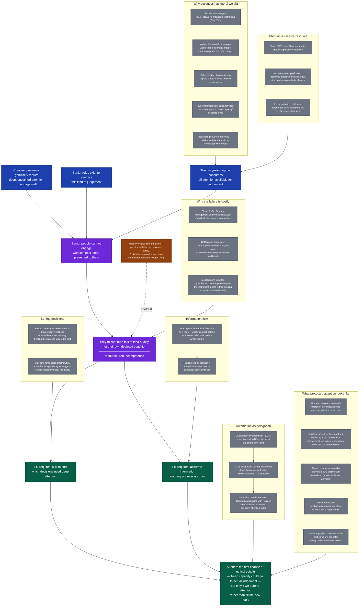

This is still early days for this. I'm in the middle of editing, I'm trying out a new way of writing essays _with_ AI rather than doing it all solo, or all AI. There's a LOT to do here, but we're getting there.

---

> We are busy in order to have leisure. — Aristotle, _Nicomachean Ethics_

A scenario:

> A senior person is handed a difficult idea. They read the first page, skim the rest, and conclude that the thinking is muddled and the writing unclear, so its author should go away and make it clearer and simpler.

Sometimes that is the case, but often what is missing is not clarity in the document but attention in the reader, who has none to spare. One encounter cannot tell you which failed, the idea or the attention, but, over time, a distribution can. An idea that draws the same objection from many readers is probably the idea's fault; one that only some readers cannot take might well be down to the reader. The manner of the pushback is telling too: a reader with attention to spare, who thinks the idea needs work, will say where and how; the depleted reader has just enough left to ask for it to be shorter.

Let’s call it _manufactured incompetence_, at least until a better phrase turns up. A capable person, in a role that exists for the exercise of judgement, is made unable to exercise it by the demands of the role. They then interpret that inability as a fault in the author of the idea rather than a condition of their own working life and the social structure that creates it. The environment rewards the appearance of seriousness, the full day and the fast reply, over the slower thing that seriousness is meant to protect.

It is tempting to reach for the _Peter Principle_[^1], which describes a ceiling: you rise until you reach a job you cannot do, and there you stall. That doesn't quite fit, I am describing a person of ample ability, in conditions that stop that ability from being expressed. If given a free week and a hard problem, that person would be formidable. The scarce resource is uninterrupted attention, not talent, and we have drifted into an arrangement in which the most senior people are the least able to access that resource.

The world is full of difficult issues, and there’s an important role for specialists in clarifying information to provide to decision makers. However there are a lot of complex issues in the world that genuinely do require deep engagement to work out a good response. The popularity of the _you can fix climate change if you just plant 1 trillion trees_[^tree] paper is a good example of this. The science since has pointed out that it’s much more nuanced, and that merely planting _a lot_ of trees can be quite a bad idea in some situations, but there is a huge appeal of a simple answer.

[^tree]: I need to reference this paper properly, and discuss it in a sidenote. **Bastin et al. (2019), "The global tree restoration potential"** published in _Science_. You should note that subsequent comments (e.g., Lewis et al., 2019) pointed out that the paper overestimated carbon storage capacity and downplayed ecological risks like disrupting native grasslands.

> “everything should be as simple as it can be but not simpler” Einstein[^e]

[^e]: needs to be referenced properly. _Everything should be made as simple as possible, but not simpler"_ is widely attributed to Einstein, but it is actually a paraphrase of a line from his 1933 Herbert Spencer lecture: _"It can scarcely be denied that the supreme goal of all theory is to make the irreducible basic elements as simple and as few as possible without having to surrender the adequate representation of a single datum of experience."_ You can use the popular paraphrase but note its origin in a footnote.

## How it is built

The people this happens to were, as a rule, excellent at something else first. They were promoted for being good at that, into a discipline nobody taught them. The Chartered Management Institute (2023) found that 82% of people entering management had received no formal management or leadership training, and 26% of senior managers and leaders had received none either.[^2] They label these as "accidental managers". Most organisations run a single ladder: to pay someone more, or to keep them, you make them a manager, whether or not managing is something they can do or want to do.

The result is a stranding; the craft that earned the promotion moves on without them, practised now by people who still have the hours on the tools to keep up, while the craft they have now been handed was never taught to them and cannot be learned in the gaps between meetings. They sit between two competences, fluent in neither. I suspect that, in the current work climate, even if they were trained explicitly, there wouldn’t be any mention of how to engage with complex issues that can’t be thought through in a 10 slide deck.

## Why the anxiety comes out as busyness

The pressure to look busy is, for most people, not vanity. It is imposed externally: a calendar filled by other people, a manager who reads a quiet hour as spare capacity, a working culture in which "you're not paid to think" can still be said with a straight face. Performance of busyness is real, but it is the smaller part. The larger part is imposed, and the imposition rests on an old assumption, that thinking is not work, that the real work is production, and that an hour not visibly producing is an hour going spare. Newport (2024) calls this pseudo-productivity: because the output of knowledge work is hard to measure, visible activity stands in for it, as the thing that can be seen.[^3]

There is a long genealogy to why we treat visible labour as virtue. Weber (1905/2001) traced the modern version to Calvinism and the doctrine of _election_, the belief that God has already chosen who will be saved and that no human act can move the verdict[^4]. The uncertainty this produced was unbearable, so believers searched their lives for signs that they were among the elect, and steady worldly diligence became, not the cause of salvation but its evidence. Idleness, by the same logic, was damning. "Waste of time," Weber wrote, "is the first and in principle the deadliest of sins." The theology ebbed away and the reflex stayed. We still treat the empty hour as guilty until it proves itself productive.

Once work carries moral weight, busyness can be shown off. Bellezza, Paharia and Keinan (2017) documented the modern convention: the overbooked, never-off professional is read as important, on the inference that a person genuinely in demand would have no time to spare[^5]. Veblen had described the opposite convention a century earlier, when the wealthy signalled rank by conspicuous abstention from work, his leisure class being people who did not have to earn a living at all (Veblen, 1899). As the leisure class has essentially disappeared, the professional, who does have to earn, now advertises worth through the full calendar rather than the empty one.

Traditionally the bottleneck has been caused by production. All the writing and coding and cutting and pasting has taken up weeks of effort, so for most people there’s been plenty of interstitial time for thinking about what they’re doing. As AI tools are more integrated into our work, the production is becoming a more trivial part of the process, the opportunities for thought are being squeezed. I once had a job where I drilled holes all day, and I did a lot of thinking while I was doing that. But now I am often working on two or more codebases at the same time in parallel AI chat sessions, my opportunities for accidental abstract thinking have been reduced almost to zero, and if I want to retain the benefits of that, I need to make those thinking opportunities an explicit part of my life.

The traditional assumption is that production is the expensive part, and thinking happens incidentally. As the making is handed to machines, the logic inverts. Deciding what is worth making and judging whether the made thing is any good, is the work that remains, and both are kinds of thinking. AI is a "faster builder" and it's also a filter for low-humanity work. Being good at mental arithmetic was valorised in my childhood, but now everyone has a calculator on their phone, I haven't heard anyone mention it for years. We are automating production while still running an attention economy built for a world where production was the bottleneck. Herbert Simon (1971) noted that a wealth of information creates a poverty of attention[^6]. Attention is finite and is the input the senior roles runs on. The busyness regime spends it on being seen to spend it.[^fix]

[^fix]: These last two paras need to be fixed up, I added the first, and haven’t fully resolved it with the second

The two tiers separate here. For most people the constraint is external: the time is not theirs to protect, and the demand to look occupied comes down the hierarchy. At the top it turns inward, though rarely on purpose. A senior leader could clear the calendar and think. What stops them is not a manager enforcing it but an audience they cannot ignore, a board, a market, a set of peers who read reserved capacity as underuse or as risk. To take the unhurried time the work needs, they would first have to win an argument with people who have no vocabulary for legible thinking. They do not lose that argument. They never have it, because it does not occur to them that it is theirs to start.

[alt para to the one above, eventually we'll probably merge them into one] There's a gradient of production making (code, drawings) to decision making as you go up the hierarchy[^email]. 

[^email]: It's probably actually a 3D graph, with communication and coordination being the main job of people in the middle, but I think the prevalence of those people is declining. [is this supported by evidence at all?]

There is a more hopeful mechanism than the one above, and it does not depend on senior people ever having had spare production hours to reclaim. It needs one more piece of scaffolding first, because "senior people don't do production" is not new information created by AI, it is the standing condition of a whole band of most hierarchies, and has been for a long time. Long before agents, team leads, department heads, directors, partners already spent their entire day on judgement-shaped work: reviewing what others made, approving or declining it, allocating scarce time and money, deciding the exception because the rule ran out. None of that is typing or drafting, and none of it goes away when AI takes over typing and drafting. It is a different, older layer from the purely information-distilling middle manager, a layer the next section argues has largely disappeared; this band makes real decisions, constantly, and has existed for as long as organisations have had more than two levels. AI eating "production" does nothing for it directly, because production was never where its day went.

The more precise version of automation as delegation, then, is not that agents free this band by taking over its typing, most of it did little typing to begin with. It is that agents start absorbing a slice of the judgement-shaped work the band already does all day: the routine review, the first-pass triage, the decision that fits an established pattern closely enough not to need a fresh mind on it. If that supervision genuinely costs less attention than supervising a person did, the freed capacity can move up, absorb some of what used to be escalated, and free the tier above in turn. Call it automation as delegation: not more hands doing the same work, but the work of deciding itself moving down a level, floor by floor, until less of it has to travel all the way to the top.[^delegation] On this account manufactured incompetence at the senior tier is not solved by handing that tier more free hours directly, since it was never spending those hours on production. It is solved, if it is solved, by pushing judgement down far enough, and with enough confidence, that the top has fewer decisions left to make, only the few that are genuinely its own.

[^delegation]: I made a version of this argument in 2015, before there was an agent to test it against: delegating to a person and delegating to a computer are the same operation underneath, a function call indifferent to what sits on the other end, and there is a moving "frontier of automation" past which a task, once specified well enough, stops needing a human at all (["Delegation == Programming"](https://notionparallax.co.uk/2015/delegation-programming), 2015). I had the mechanism right and the case wrong. I filed computers as precise and fault-intolerant and people as fault-tolerant but imprecise, needing negotiation before delegation would work; an agent is fault-tolerant and interpretive, which puts it on the person side of that line, and is why working with one now gets described in the vocabulary of management, feedback, evaluated output, a brief you'd hand a new hire, rather than the vocabulary of a script (Mollick, 2026, "management as AI superpower"). The frontier moved as expected. What crossed it did not stay code-shaped.

The hope carries a condition, and the essay has already named it once, a few sentences up. Delegation only frees the delegator's attention if it is trusted enough to be left alone; oversight that still has to check everything is not delegation, it is what one recent account of AI in management calls "directed outsourcing with retained accountability," execution handed off, judgement and liability kept.[^retained] If that is the more accurate description of how agents are actually being used, then pushing decisions down does not shrink anyone's load at any layer of the band just described, it widens the span of it: more decisions get made below you, and you are still on the hook to check more of them, only faster and less visibly. That is not freed attention, it is the same attention smeared across a wider front, Leroy's residue problem again, relocated a floor up rather than resolved. Automation-as-delegation and manufactured incompetence are both live outcomes of the same technology, and which one an organisation gets depends on whether it can extend to an agent the kind of unaudited trust it has historically struggled to extend to a junior colleague, for the same audience-shaped reasons already described. More of the day either way moves into what the next section calls manager-mode, evaluating and passing on rather than shaping. Whether that leaves the higher-order work, the judgement itself, any better resourced, or simply moves the same shortage up a floor, is the question the rest of this essay is really asking. Two things would have to be true for the hopeful version to win, and they are the subject of the next two sections: a way to tell which decisions are worth the trip to the top, and a way of getting the top enough information to tell.

[^retained]: The phrase and the diagnosis come from recent commentary on AI delegation in management practice: organisations mostly are not delegating to agents in the full sense yet, because judgement, quality assurance and accountability tend to stay with the human even as execution moves across. The distinction matters here because it is the same fork this essay has been describing throughout, whether attention gets protected and reserved, or merely spent faster and less visibly.

## Which decisions are yours

Automation as delegation, in its most hopeful reading, frees attention rather than merely relocating it. But freed attention is not self-directing. Handed back an hour, the reflex this essay has been describing does not ask what the hour is for; it looks for something to fill it with, and busyness is very good at supplying candidates. What is missing is not more free time but a way of sorting the decisions that land on a freed desk into the ones that are actually the freed person's to sit with and the ones that were never worth the trip up the hierarchy in the first place.

Jeff Bezos gave the clearest public version of that sort in his 2015 letter to Amazon's shareholders. Some decisions are consequential and hard, or impossible, to reverse, one-way doors: walk through, dislike the view, and there is no walking back. Most decisions are not like that; they are two-way doors, correctable at modest cost, and the right move on a two-way door is to make it quickly, on incomplete information, because the delay costs more than an occasional wrong guess.[^bezos] His complaint was that organisations drift, as they grow, into using the one-way-door process, slow, consultative, covering every base, on decisions that are actually two-way doors, which is a tidy technical name for exactly the busyness this essay has been describing: heavyweight seriousness spent on a decision that did not need it, at the cost of the attention the genuine one-way doors were owed.

[^bezos]: Bezos, J. (2015, April 6). _2015 letter to shareholders_. Amazon.com. He labels these Type 1 (one-way door) and Type 2 (two-way door) decisions, and argues that large organisations default to applying Type 1 process to Type 2 decisions, producing "slowness, unthoughtful risk aversion, failure to experiment sufficiently, and consequently diminished invention." That sentence could be dropped into this essay's section on busyness without changing a word.

I first heard a version of the same sort from Patrick Collison, in an interview where I understood the interviewer to be relaying a distinction they'd read rather than coining it themselves, which suggests the idea has been arrived at independently more than once, always by people who spend their day fielding more decisions than they have judgement to spare for. Collison's version adds a second axis to Bezos's one: not just how reversible a decision is, but how much it matters if you get it wrong. A decision that is both hard to reverse and high-stakes deserves real deliberation. One that is either easily undone or simply doesn't matter much should be made fast, on a guess, precisely so the saved attention can go toward finding out sooner whether the guess was right.[^collison] Put the two frameworks together and the test a freed hour needs is not "is this decision annoying" but "which door is this, and how much does it matter if I choose wrong," a question that can be taught, unlike taste, and asked in seconds, unlike a strategy review.

[^collison]: I can't pin the exact interview; searching afterwards, the clearest citable version is Patrick Collison's own solo appearances on _The Tim Ferriss Show_ (2018) and Farnam Street's _Knowledge Project_ (2018), where he describes sorting decisions by reversibility and magnitude rather than treating them uniformly. Whether the interviewer who introduced me to the idea was quoting Collison, quoting Bezos, or reporting a piece of business-podcast folklore both are downstream of, I don't know, and it doesn't much matter here: the two framings are close enough kin for the essay to use as one idea with two named sources.

Applied back to the opening scenario, the senior person skimming a difficult idea and asking for it to be made shorter is running a one-way-door problem through two-way-door process: the idea, if it is genuinely load-bearing, is exactly the kind of thing that is expensive to get wrong and hard to undo once acted on or dismissed, and it is being decided at the speed appropriate to choosing which call to skip. Manufactured incompetence and Bezos's organisational drift turn out to be the same failure seen from opposite ends. His firms over-invest process in decisions that never needed it; my senior reader under-invests attention in the one decision that did. Both come from the same missing skill, not knowing which door you are standing in front of, and both are what happens when the sorting is never taught, never made explicit, and left instead to whatever a depleted attention defaults to, which is to treat everything as a two-way door because that is the only kind there is time left to open.

## Getting the information to the decision

Knowing which door a decision is does no good if the decision never reaches you in a state you can judge. Hierarchies are, among other things, filtering devices: information about what is actually happening is generated at the bottom, closest to the problem, and by the time it has been summarised, cleared and carried up far enough to reach someone with the authority to act on it, most of what would have let them tell a one-way door from a two-way one has been filtered out along the way. This essay opened with a specialist's job of packaging a complex idea for someone with no time to spare; that packaging is not a failure of the system, it is a feature of it, and the same feature is what strands the freed, well-triaged attention of the previous section with nothing accurate to apply itself to.

General Stanley McChrystal ran into the sharpest version of this problem commanding the Joint Special Operations Task Force in Iraq from 2003. Al-Qaeda in Iraq operated as a fast, decentralised network; the task force, however good its people, was organised as a set of stovepiped specialist units, each holding a piece of the picture and none holding the whole of it, so decisions kept climbing to the top not because they were genuinely one-way doors but because nobody lower down had enough of the picture to tell. His account of the fix, written up with Tantum Collins, David Silverman and Chris Fussell as _Team of Teams_, was to stop routing information up a chain of command and back down as orders, and instead push it sideways too, so that every part of the organisation had something closer to the same view of the whole as the people at the top, a condition they called shared consciousness.[^teamofteams] The point was not to remove hierarchy or flatten authority for its own sake; it was that decisions could only be pushed down to the people fast enough and close enough to make them well once those people had stopped being the last to know.

[^teamofteams]: McChrystal, S., Collins, T., Silverman, D., & Fussell, C. (2015). _Team of teams: New rules of engagement for a complex world_. Portfolio/Penguin. Shared consciousness is their term for the state McChrystal's task force reached once information stopped being hoarded at each node and was instead made radically visible across the organisation, on the argument that this, not any change to who formally had authority to decide, is what let decisions move to wherever they could be made fastest and best.

The structure that did the actual work of manufacturing that shared consciousness, rather than merely wishing for it, was the fusion cell: a standing arrangement that sits people from otherwise separate units, intelligence, operations, whichever specialisms the problem touches, in the same room with the same feed of information, so that what one part of the organisation learns is available to the rest of it as it happens rather than at the next scheduled report. It is Fussell's own master's thesis, written at the Naval Postgraduate School with Trevor Hough and Matthew Pedersen, that did the empirical work of asking what made these cells effective rather than merely present, and the answer was not the org chart but the practice: co-location, a shared information feed, and enough delegated trust that someone in the cell could act on what they were seeing instead of relaying it upward and waiting.[^fussell] The popularised version in _Team of Teams_ is the argument; the thesis is the evidence that the argument survives contact with an actual organisation rather than staying a slogan about transparency.

[^fussell]: Fussell, C. L., Hough, T. W., & Pedersen, M. D. (2009). _What makes fusion cells effective?_ [Master's thesis, Naval Postgraduate School]. That the fusion cell concept, later popularised through _Team of Teams_, was first worked out as Fussell's own thesis research, grounded in his prior JSOC experience rather than arrived at from theory first, is worth keeping in view: this is a case where the practice came before the write-up, and the write-up is more careful about mechanism than the business-book version that followed it.

None of this is a claim that a firm or a design practice should adopt military structure; it is a claim that the specific failure McChrystal was solving, decisions escalating past the people equipped to make them because information never reached the people equipped to make them, is the organisational form of manufactured incompetence, not a metaphor for it. It is also, looked at from the other side, the missing piece in the more troubling account of automation-as-delegation from earlier: "directed outsourcing with retained accountability" is exactly what you get when decisions are pushed down without the information being pushed sideways, execution moves, judgement stays put, because whoever is meant to exercise it lower down was never given enough of the picture to be trusted with it, and the person at the top keeps checking because checking is the only form of confidence the arrangement has left them. Genuine delegation, of the kind that actually frees attention rather than smearing it across a wider front, needs the same fix McChrystal needed: the people making the fast, two-way-door calls need to be looking at something close to the same information the person above them would have used, or the trust that would let those calls stand unchecked never arrives.

Two conditions, then, not one. A person needs the skill to sort what lands on their desk by which door it is behind. An organisation needs to have already solved the older, less glamorous problem of getting accurate information to wherever that sorting is happening, rather than hoarding it at the level that used to have the most spare time to read it. Together, and only together, they are what would let the freed hour from automation as delegation land on the right desk, already carrying enough to be judged, instead of arriving stripped of everything that would have told its recipient which kind of decision it was. What that hour is actually for, once it does land well, is the question the next two sections take up.

## The maker who forgot they were a maker

Graham (2009) drew the useful distinction between the maker's schedule and the manager's[^7]. Makers needs long unbroken stretches; a single meeting dropped in after lunch splits the day into two pieces too small to build anything in. Managers live in interchangeable hourly boxes and cannot see the problem. Graham’s own fix was to bolt his meetings to the end of the day and keep the mornings whole.

< roughly edited as far as here >

At least in the world I interact with, there are very few pure managers, the layers of management that were there purely for upward information-distillation seem to be gone. Graham sorts _people_ into makers and managers, but realistically they’re more opposing mindsets than distinct groups.[^8] Everyone makes things, everyone who devises "courses of action aimed at changing existing situations into preferred ones" (Simon, 1969) is designing. It might be worth thinking about leaders as _makers of choices_. The mind behind a material artifact is doing the same processes that the mind behind a sales plan or a social policy is doing. A strategy document, a contract, a restructure strategy, a fee model, a decision about who sits next to whom: all of these are designed, and designing them well is challenging. The more useful cut runs not between maker-people and manager-people but between two _modes_ the same person moves through. There is maker-mode, in which a thing is held long enough to be shaped, and manager-mode, in which inputs are received, sorted, and passed on.

What the leader has lost is not the capacity to make. It is the recognition that their own highest-value output is a made thing, with a maker's requirements. They have been alienated from the craft nature of their own work.[^9] Judgement, synthesis, the ability to stay inside a hard problem until it yields: these are not the overhead around the real job, they are the job. Treated as overhead, they get the scraps of attention left once the calendar has taken its cut, and the scraps are not enough. When a difficult idea then arrives and will not go in, the natural move for someone who no longer believes thinking is work is to conclude that the idea, not the depleted attention receiving it, is at fault. The cost of switching is real and it compounds. Leroy (2009) showed that when we move between tasks a residue of the last one lingers and drags on the next, so a day chopped into fragments is not a day of many small productivities but a day spent mostly in the smear between them.[^10] [this para feels like we’re getting a bit lost. We’re talking too much about being a maker, and not enough about being a judge. The maker angle is great, and I think we should keep it but it’s disappearing down its own rabbit hole. the core of this argument is really about attention, and having what you need to be able to bring the force of that attention to bear on a problem. The following section on leisure needs to stay attached to that core idea, so it doesn’t just get too excited about leisure as a good in itself, or distracted down a deep-work rabbit hole, etc.]

## What leisure was for

The Greek is _scholē_ (the origin of our "school")[^11] did not mean rest or amusement, it meant freedom from the pressure of necessity, the condition under which the highest activity, contemplation, became possible. Aristotle's (ca. 350 B.C.E./2009) formula is that we are busy in order to be at leisure, not the reverse; work is for the sake of scholē, and to invert that is to mistake the means for the end. One concession before leaning further on him: the leisure Aristotle prized was for contemplation pursued as an end in itself, not for getting through a strategy paper faster. I borrow scholē for its shape, freedom from the pressure of necessity, and for its etymology, not to smuggle in a claim that leaders need philosophy. It is the shape the modern worker has lost, and it will hold deep reading, incubation or hard judgement equally well. The Latin word for leisure was _otium_, and their word for business, for the state of not being at leisure, was _negotium_, which is simply _nec-otium_, the negation of leisure. Business was defined, in the language itself, as the absence of the condition in which thought happens.

One thing to bear in mind is that Athenian leisure rested on people who had none, on enslaved workers and on women whose labour was not counted. Scholē was an unacknowledged class privilege before it was a philosophical ideal, and any argument that reaches for it has to engage with that.[^12] The Greeks were right about what leisure was _for_ even while being wrong about who deserved it. The uncomfortable question is not whether contemplative freedom is worth having but who gets to have it, and at whose expense.

Pieper's (1948/1998) argument in _Leisure: The Basis of Culture_ is that leisure is not the reward that follows work but the precondition of any work worth doing, a stance of receptive openness in which real insight can arrive, and that a culture of "total work," which grants legitimacy to nothing that is not visibly labour, corrodes the very faculty that thought depends on.[^13] Set against the leader who cannot afford to be seen doing nothing, Pieper is not quaint. He is describing the exact organ that manufactured incompetence removes. [I don't understand this well enough, so I don't think the reader will understand it either.]

The disciplines that kept a theory of this survived better. Mathematics and physics prize hard grinding, and they also honour the person lying on a sofa staring at the ceiling, because they have never confused the second with idleness. Wallas (1926), a co-founder of the London School of Economics, set out the stages of creative thought a century ago, and the load-bearing one is incubation, the interval in which you deliberately stop working on a problem so the mind can work on it without you.[^14] He drew it partly from Poincaré's (1908/1952) account of a solution to an abandoned problem arriving as he stepped onto a bus with his mind entirely elsewhere. These fields have a doctrine that sanctions the empty afternoon. They can point to it and say that this is a stage of the work, not a lapse from it.

The creative professions have no such doctrine, and the reason is legibility rather than temperament. A proof either checks or it does not, so mathematics can be indifferent to how you reached it; the result vouches for the process after the fact. Design output cannot vouch for itself the same way. It is satisficing, in Simon's sense, a good-enough choice pulled from a solution space far too large to search to the end, and nobody can show that this plan is the best plan, because the search that would prove it never terminates. Into that gap steps process as evidence: unable to prove the output is good, you prove instead that you worked hard for it, and hard work means visible hours. Architecture then adds a myth of its own, the heroic gesture, the master's sketch thrown down whole on a napkin, which worships the instantaneous flash and so credits neither the long grind nor the slow incubation. The field ends with the worst of both cultures. It will not count thinking as work, and it will not count patience as thinking.

## What it costs, and to whom

There is an economics to this that is more than metaphor. Cyert and March named organisational slack decades ago and argued that it is not waste but reserve, the spare resource that lets a firm absorb a shock or pursue something new instead of merely surviving the day (Cyert & March, 1963).[^15] DeMarco put it more sharply, borrowing from queueing theory: as any system nears full utilisation its ability to respond does not fall away gently, it collapses, because a queue at a hundred percent has nowhere to put the next arrival (DeMarco, 2001).[^16] An organisation that runs its people at total capacity has optimised away the very thing that lets it think and adapt, and has done so while congratulating itself on efficiency.

The name for the loss is X-inefficiency. Leibenstein coined it for firms that produce less than their inputs allow, not by misallocating resources in the textbook sense but through slack inside the organisation, effort withheld, attention misspent (Leibenstein, 1966).[^17] Usually the word slack is an accusation, and there is a tension worth naming rather than smoothing over: Leibenstein's slack is the disease, and I am about to call a kind of slack the cure. They are two different things wearing one word. Idle effort is waste. Reserved attention, held so that thought and response stay possible, is not. A regime that stamps out every visible gap removes both, and in removing the second it lowers the output it set out to raise. Running people at full tilt does not maximise what they produce. It maximises what they produce that can be seen.

That the loss is real and measurable is no longer arguable. The World Management Survey, run by Bloom and Van Reenen across tens of thousands of firms, found that management practice is strongly tied to productivity, profitability and survival, that badly managed firms form a long persistent tail, and, in the largest study, that management practices account for more than a fifth of the variation in productivity between plants, a share comparable to or larger than research spending, technology or workforce skill (Bloom & Van Reenen, 2007, 2010; Bloom et al., 2019).[^18] Management is not the soft residue left over once the real inputs are counted. It is one of the real inputs, and how a leader spends their attention is much of what the word means.

If firms routinely produce below their potential, then society gets less than it could from the same people, materials and time, and the shortfall is real output that never came into being. I am inclined to go one street further and say that because the state supplies so many of the inputs, the educated people, the infrastructure, the stable institutions, a chronically under-producing private sector returns less to the state than it received, which shows up as a tax burden heavier than it needed to be and private exchanges thinner than they might have been, a slow leak in the collective account.[^19] That last step is mine, and I hold it more loosely than the rest; the economics I can cite stops at the firm. The firm-level claim alone is enough to make the point uncomfortable. The leader who cannot find an hour to think is not indulging a private vice. They are a small recurring loss in a very large ledger.

We (architects) do not, for the most part, bill clients by the hour. We agree a fee for a phase of work and live with the difference between that fee and what the work actually costs us; the timesheets we keep are internal. On paper this is outcome pricing, and it ought to free us from the tyranny of the billable minute. It does not, quite, and I have started to suspect why. Under a fixed fee, an hour spent thinking rather than producing is not merely unbillable, which would make it invisible. It is worse than invisible, because it is a direct subtraction from the margin on a pot that cannot grow. The rational response to a capped fee is to compress the hours, and the hours easiest to compress are the quiet ones with nothing to show. So the instrument meant to buy us freedom to think may be the one most efficiently taxing the thinking away. I do not know that this is true. I know it is the shape of the thing I feel.

There is a version of this that ends well. We are building machines to do the producing, and if the old excuse for filling every hour was that the hour could be spent making something, that excuse is dissolving. The freed capacity could go to the thing the making was always meant to serve, deciding what is worth doing and thinking hard about whether we are doing it. It could equally be swallowed whole and poured back into doing more, faster, because the reflex that reads an empty hour as waste will not retire simply because the work has changed. The Greeks bought their leisure with other people's unfreedom. We may be about to buy ours with machines, and the open question is whether we will have kept the faculty to use it, or whether we will only have found new hours to fill. This is the first time in history that humanity has the chance to carve out ethical _scholē_—where the "unfree labour" keeping the system running is on a non-biological substrate.[^bio]

[^bio]: The question of the moral status of thinking agents is a tricky one. You've got Douglas Hofstadter arguing that a light switch has a tiny amount of consciousness, Brian Tomasik thinking about [Do Video-Game Characters Matter Morally?](https://reducing-suffering.org/do-video-game-characters-matter-morally/) and Dave  Chalmers asking ["Are Large Language Models Sentient?"](https://www.youtube.com/watch?v=-BcuCmf00_Y). And because this isn't a question I've been following for a while now, I'm really not sure. I'm inclined to say that current systems aren't morally significant, but that could change soon. (Another interesting question raised by Blade RUnner 2049.)

We have built work that depends, at its most valuable, on unhurried attention, and then arranged our institutions so that unhurried attention is the one thing a serious person may not be seen to take. The senior person skimming the difficult idea is not failing at the job. They are succeeding at the job we actually set, which is to appear fully occupied at all times, and that success is what makes the other job, the real one, impossible. _Negotium_ was the negation of leisure. We have built a whole economy of it and called the negation the work.

[^1]: Peter and Hull (1969) argued that in a hierarchy people rise to their "level of incompetence" and stop, each promotion continuing until it reaches a role the person cannot perform. The mechanism is a ratchet: past success predicts the next promotion but not success in the differently shaped job it leads to. Manufactured incompetence is a different animal, and the difference matters. Peter's manager is genuinely unable; mine is able and prevented. If Peter is right, the fix is better promotion decisions. If I am right, better promotion decisions barely touch it, because the same able person would be blocked either way. The two can of course afflict one unlucky person at once.

[^2]: The figures come from _Taking Responsibility: Why UK plc Needs Better Managers_ (Chartered Management Institute, 2023), a YouGov study whose management sample was 2,524 people with management experience, fielded in June 2023. Two honest qualifications. It is UK data, and "no formal training" is self-reported, so it counts the absence of a credential, not the presence of incompetence; a well-mentored manager with no certificate reads as untrained here. My argument supplies the reason the untraining matters; the survey does not. The same research carries a detail that fits the promoted-for-the-wrong-reasons thread: 46% of managers believed colleagues had won promotion on internal relationships and profile rather than ability.

[^3]: Newport (2024) is the most prominent recent treatment and names the disease cleanly. It comes with a caveat worth passing on rather than burying: a recurring criticism is that he runs "knowledge workers," "creative workers" and "scientific researchers" together when the work differs in kind, and the sofa that serves a theoretical physicist may not transfer to a manager clearing a queue. That objection is useful to this argument rather than damaging, because the transfer question is exactly what the later section on legibility is trying to answer.

[^4]: "Election" is Calvin's own term, and Weber (1905/2001) builds the whole thesis on it: the doctrine of predestination held that salvation was already decided and unalterable, which left believers with no way to earn grace and every incentive to look for evidence they already had it. Steady, ascetic diligence in a worldly calling became that evidence. The mechanism is an "elective affinity," in Weber's careful phrase, not a simple cause: Protestantism did not invent capitalism, it supplied a disposition that capitalism could use. I take Weber here as genealogy, to explain how the moral charge first attached to visible labour, and treat Bellezza et al. (2017) as the live present-day mechanism. Stacked as rival causes the two would compete; used as origin and engine they do not.

[^5]: Bellezza et al. (2017) found the status inference is mediated by perceived scarcity: the busy person is read as in demand, therefore valuable. The effect is not universal, which is the interesting part for anyone hoping it might shift. It was moderated by belief in social mobility and varied by culture, stronger in the United States than in parts of Europe, where a visibly leisured life still carries more status. Busyness-as-status is a belief, not a law, and beliefs move. The paper is a deliberate inversion of Veblen (1899), whose leisure class signalled rank by conspicuous abstention from labour, a class that did not have to work at all. Worth keeping straight: these are not the same people flipping their behaviour but a different class, the salaried professional, adopting the opposite marker.

[^6]: Simon's formulation, from a 1971 essay for a symposium on computers and the public interest, is that a wealth of information creates a poverty of attention and a need to allocate that attention efficiently among the sources that might consume it. It predates the conditions that made it obvious. Its use here is to move "attention" out of the soft, psychological register and into the economic one, a scarce resource with an allocation problem, which is the register the essay's economics later works in. It is the same Simon who gave us "satisficing," which returns in the section on design.

[^7]: Graham (2009) is an essay, not a study, and argues from direct experience of running Y Combinator while trying to write and build. Its strength and its limit are the same: it is candid about resting on observation rather than data. His office-hours device, clustering all meetings at the end of the day to keep the morning intact, is the most-copied practical response, and it is telling that his own solution treats maker-time as the thing to defend and manager-time as the necessary intrusion, not the reverse.

[^8]: This is a deliberate departure from Graham. He types people; I type modes, because typing people licenses the very fatalism the essay argues against ("I'm a manager now, the makers are the ones downstairs"). If the line runs between modes the same person occupies, then a senior leader's inability to enter maker-mode is a solvable feature of the schedule rather than a fixed feature of the role. Whether it is solvable in practice, given the board-shaped constraint above, is the question the essay leaves open.

[^9]: I mean "alienated" in something close to its original sense, separated from the product and nature of one's own labour, no longer recognising it as one's own making. The point does not need the full apparatus. It needs only the observation that a person who has stopped experiencing their strategy work as making will defend the time it takes about as well as they defend a coffee break, which is to say not at all.

[^10]: Leroy (2009) called it attention residue: after a switch, part of one's attention stays snagged on the previous task and performance on the new one suffers until the residue clears. The consequence is that the cost of a fragmented day is not linear in the number of interruptions. Each switch leaves a tail, the tails overlap, and ten context switches do not levy ten small taxes so much as leave the day smeared.

[^11]: The etymology is not decoration. _Scholē_ (σχολή) is the direct ancestor of "school," by way of Latin _schola_: the place of learning is named for the leisure that made learning possible. The Aristotle for the argument is the _Nicomachean Ethics_ Book X, on contemplation as the highest activity, and the treatment of leisure and education in the _Politics_ Books VII and VIII. The claim that we are busy in order to be at leisure (_ascholoumetha hina scholazōmen_) is his, and it is the exact reversal of the modern arrangement, in which leisure, when permitted at all, is justified as the recovery that makes one fit for more work.

[^12]: The support structure that buys thinking time has never gone away; it has been institutionalised. The seventeenth- and eighteenth-century gentleman natural philosopher could think at leisure because a household, an inherited income and usually a wife ran the rest of his life for him. We have largely moved that arrangement into universities and research institutes, trading the amateur's versatility for the specialist's depth. The trade carries a cost the amateur did not pay: specialisation narrows the range of things a mind holds in view at once, and some of the most useful ideas come from holding distant things together. Whether AI restores a kind of generalist leisure, freeing people to think broadly again, or merely accelerates the demand to produce, is a question large enough for its own essay, and this one only circles it.

[^13]: Pieper (1948/1998) wrote in the wreckage of post-war Germany against what he called the world of "total work," and tied the loss of leisure to _acedia_, an old word for a restless inability to be at peace with oneself that disguises itself as diligence. The busy leader who cannot sit still with an idea is, in Pieper's terms, not virtuous but acediac, filling every hour precisely because stopping is intolerable. Whether or not one takes his theology, the psychological portrait is uncomfortably recognisable. Wikipedia says that: _Acedia is a state of apathy, listlessness, or profound existential emptiness. Originating from the Greek word for "lack of care" or "negligence", it is an ancient term describing an inability to care about one's duties, condition, or spiritual well-being, often manifesting as deep boredom, restlessness, or procrastination._

[^14]: Wallas (1926) named four stages, preparation, incubation, illumination and verification, building on Helmholtz's earlier three and on Poincaré's introspection. Two things are worth lifting out. First, he explicitly recommended building interruption into the workflow, starting several problems and deliberately leaving them unfinished, as a way to let incubation do its work: designed-in cognitive slack, argued in 1926. Second, that he co-founded the LSE is a small irony, given that the same institution's later economists (Bloom and Van Reenen, note 18) would go on to quantify the productivity cost of the management culture that has no room for what Wallas described. The empirical picture on incubation is real but modest: a meta-analysis found the effect genuine but small and condition-dependent (Sio & Ormerod, 2009), and the neuroscience often marshalled here (the default-mode network's activity during rest and mind-wandering, and its association with creative cognition; Beaty et al., 2014; Baird et al., 2012) is drawn from laboratory creativity tasks, not executives metabolising strategy. There is even a tidy experimental version of the sofa: walking, indoors or out, reliably raises divergent (idea-generating) thinking while slightly lowering convergent (single-answer) thinking, and the boost lingers after you sit back down (Oppezzo & Schwartz, 2014). Take all of it as suggestive analogy. The transfer from lab creativity to leadership judgement is unverified, and the argument rests on Wallas and Poincaré, not on the fMRI.

[^15]: Cyert and March (1963) introduced organisational slack as resources beyond the minimum needed to keep the organisation running, and argued that far from being pure waste it is what lets a firm innovate, absorb bad years, and pursue projects that do not pay at once. It is the direct ancestor of the designed-slack argument and the conceptual cousin of Leibenstein (note 17), though the two point in opposite normative directions, which is the tension the body tries to resolve.

[^16]: DeMarco (2001) is the operational core of the idea and its cleanest statement. The queueing point: where work arrives somewhat unpredictably, waiting time rises non-linearly with utilisation and heads for infinity as utilisation approaches a hundred percent. A road at full capacity is a car park. An organisation run at full utilisation has, by the same mathematics, destroyed its own responsiveness, and the slack it eliminated was the capacity to respond.

[^17]: Leibenstein (1966) distinguished X-inefficiency from the allocative inefficiency economists usually model, and suggested it may be the larger loss by a wide margin, with some later estimates putting X-inefficiency losses at a multiple of the classic deadweight triangle. The awkwardness for me is that Leibenstein treats internal slack as the pathology competition exists to discipline away, whereas I am defending a kind of slack. The reconciliation, in the body, is that "slack" names two things: effort withheld (waste) and attention reserved (productive capacity). My claim is that the busyness regime cannot tell them apart and so destroys the second while hunting the first, producing X-inefficiency in Leibenstein's own sense. It is arguable, and I would rather leave the argument visible than paper over it.

[^18]: The World Management Survey findings run across a programme of work: a strong association between management practice and firm-level productivity, profitability and survival, with wide variation across and within countries and a long tail of badly managed firms (Bloom & Van Reenen, 2007); the case that persistent productivity differences between firms and nations largely reflect management practice (Bloom & Van Reenen, 2010); and, from a study of roughly 35,000 US plants, the finding that structured management practices account for more than 20% of the variance in productivity, comparable to or greater than R&D, information technology or human capital (Bloom et al., 2019). The measure is noisy and the direction of causation is not fully settled, but the weight of evidence that management is a first-order input rather than a residual is now considerable.

[^19]: This paragraph is my own extension, and I flag it as speculation rather than citable economics. The firm-level loss, real output foregone, is well supported. The move to "therefore the state's return on its inputs is lower, therefore taxes are heavier than needed, therefore a vicious cycle" adds causal steps that neither Leibenstein nor the World Management Survey licenses, and a careful economist would want to model, among other things, where the foregone output would otherwise have gone and whether the state actually bears the residual. I include it because it is the shape of my intuition about why this is not merely a firm's private problem, not because I can stand it up. The modest version, which I do stand behind: firms systematically under-produce relative to their potential, management is a large part of why, and the shortfall is borne by everyone downstream of the firm.

## References

Aristotle. (2009). _The Nicomachean ethics_ (W. D. Ross, Trans.; L. Brown, Ed.). Oxford University Press. (Original work published ca. 350 B.C.E.)

Baird, B., Smallwood, J., Mrazek, M. D., Kam, J. W. Y., Franklin, M. S., & Schooler, J. W. (2012). Inspired by distraction: Mind wandering facilitates creative incubation. _Psychological Science, 23_(10), 1117–1122. [https://doi.org/10.1177/0956797612446024](https://doi.org/10.1177/0956797612446024)

Beaty, R. E., Benedek, M., Wilkins, R. W., Jauk, E., Fink, A., Silvia, P. J., Hodges, D. A., Koschutnig, K., & Neubauer, A. C. (2014). Creativity and the default network: A functional connectivity analysis of the creative brain at rest. _Neuropsychologia, 64_, 92–98. [https://doi.org/10.1016/j.neuropsychologia.2014.09.019](https://doi.org/10.1016/j.neuropsychologia.2014.09.019 "https://doi.org/10.1016/j.neuropsychologia.2014.09.019")

Bezos, J. (2015, April 6). _2015 letter to shareholders_. Amazon.com. [https://s2.q4cdn.com/299287126/files/doc_financials/annual/2015-Letter-to-Shareholders.PDF](https://s2.q4cdn.com/299287126/files/doc_financials/annual/2015-Letter-to-Shareholders.PDF)

Bellezza, S., Paharia, N., & Keinan, A. (2017). Conspicuous consumption of time: When busyness and lack of leisure time become a status symbol. _Journal of Consumer Research, 44_(1), 118–138. [Conspicuous Consumption of Time: When Busyness and Lack of Leisure Time Become a Status Symbol](https://doi.org/10.1093/jcr/ucw076)

Bloom, N., Brynjolfsson, E., Foster, L., Jarmin, R., Patnaik, M., Saporta-Eksten, I., & Van Reenen, J. (2019). What drives differences in management practices? _American Economic Review, 109_(5), 1648–1683. [What Drives Differences in Management Practices?](https://doi.org/10.1257/aer.20170491)

Bloom, N., & Van Reenen, J. (2007). Measuring and explaining management practices across firms and countries. _The Quarterly Journal of Economics, 122_(4), 1351–1408. [Measuring and Explaining Management Practices Across Firms and Countries\*](https://doi.org/10.1162/qjec.2007.122.4.1351)

Bloom, N., & Van Reenen, J. (2010). Why do management practices differ across firms and countries? _Journal of Economic Perspectives, 24_(1), 203–224. [Why Do Management Practices Differ across Firms and Countries?](https://doi.org/10.1257/jep.24.1.203)

Chartered Management Institute. (2023). _Taking responsibility: Why UK plc needs better managers_. Chartered Management Institute.

Collison, P. (2018, December 24). _The Tim Ferriss Show_ (No. 353) [Audio podcast episode]. Tim Ferriss. [https://tim.blog/2018/12/24/the-tim-ferriss-show-patrick-collison/](https://tim.blog/2018/12/24/the-tim-ferriss-show-patrick-collison/)

Cyert, R. M., & March, J. G. (1963). _A behavioral theory of the firm_. Prentice-Hall.

DeMarco, T. (2001). _Slack: Getting past burnout, busywork, and the myth of total efficiency_. Broadway Books.

Fussell, C. L., Hough, T. W., & Pedersen, M. D. (2009). _What makes fusion cells effective?_ [Master's thesis, Naval Postgraduate School]. Calhoun: NPS Institutional Archive. [https://calhoun.nps.edu/handle/10945/4438](https://calhoun.nps.edu/handle/10945/4438)

Graham, P. (2009, July). _Maker's schedule, manager's schedule_. [Maker's Schedule, Manager's Schedule](http://www.paulgraham.com/makersschedule.html)

Leibenstein, H. (1966). Allocative efficiency vs. "X-efficiency." _The American Economic Review, 56_(3), 392–415.

Leroy, S. (2009). Why is it so hard to do my work? The challenge of attention residue when switching between work tasks. _Organizational Behavior and Human Decision Processes, 109_(2), 168–181. [https://doi.org/10.1016/j.obhdp.2009.04.002](https://doi.org/10.1016/j.obhdp.2009.04.002 "https://doi.org/10.1016/j.obhdp.2009.04.002")

McChrystal, S., Collins, T., Silverman, D., & Fussell, C. (2015). _Team of teams: New rules of engagement for a complex world_. Portfolio/Penguin.

Newport, C. (2024). _Slow productivity: The lost art of accomplishment without burnout_. Portfolio/Penguin.

Oppezzo, M., & Schwartz, D. L. (2014). Give your ideas some legs: The positive effect of walking on creative thinking. _Journal of Experimental Psychology: Learning, Memory, and Cognition, 40_(4), 1142–1152. [APA PsycNet](https://doi.org/10.1037/a0036577)

Peter, L. J., & Hull, R. (1969). _The Peter principle: Why things always go wrong_. William Morrow.

Pieper, J. (1998). _Leisure: The basis of culture_ (G. Malsbary, Trans.). St. Augustine's Press. (Original work published 1948)

Poincaré, H. (1952). Mathematical creation. In B. Ghiselin (Ed.), _The creative process: A symposium_ (pp. 22–31). University of California Press. (Original work published 1908)

Simon, H. A. (1969). _The sciences of the artificial_. MIT Press.

Simon, H. A. (1971). Designing organizations for an information-rich world. In M. Greenberger (Ed.), _Computers, communications, and the public interest_ (pp. 37–72). Johns Hopkins Press.

Sio, U. N., & Ormerod, T. C. (2009). Does incubation enhance problem solving? A meta-analytic review. _Psychological Bulletin, 135_(1), 94–120. [APA PsycNet](https://doi.org/10.1037/a0014212)

Veblen, T. (1899). _The theory of the leisure class: An economic study of institutions_. Macmillan.

Wallas, G. (1926). _The art of thought_. Jonathan Cape.

Weber, M. (2001). _The Protestant ethic and the spirit of capitalism_ (T. Parsons, Trans.). Routledge. (Original work published 1905)

## Appendix: imagined critiques

_A panel of readers, each responding to a specific claim above rather than the essay in general. Sorted alphabetically by surname._

### Hannah Arendt

You are running two different things together under the word "judgement," and the conflation is costing you. There is _work_ — fabrication, the maker shaping a durable thing, which is what your Graham section and your maker-mode/manager-mode distinction actually describe. And there is _action_ — plural, unpredictable, exercised among others, disclosed in speech, which is what a senior person exercising judgement on a contested idea is actually doing. You treat both as versions of the same attention-starved production problem, solvable by the same fix (protect the hours, sort the inputs). But action doesn't fabricate an output the way work does, and Bezos's door-sorting, however useful for two-way operational calls, is a fabrication-logic tool. Applied to genuine deliberation among peers over a hard idea, it risks producing exactly the "shorter, please" reflex you're diagnosing — efficient handling of what should have been left open.

Your closing hope — that AI-freed hours go to "actual judgement" — still describes _vita activa_ reabsorbing _vita contemplativa_ into productivity. Contemplation, for Aristotle as much as for me, is not supposed to produce a decision faster. If the freed hour is only justified because it yields better output, you haven't recovered scholē, you've optimized total work more cleverly. That is the total-work logic Pieper is trying to name, and your own resolution may be quietly inside it.

### Peter Drucker

You've rediscovered _The Effective Executive_ and not cited it, which surprises me more than anything else in the piece — time as the one truly scarce, non-substitutable resource; the need to consolidate discretionary time into large blocks rather than let it be shredded; the discipline of knowing where your time actually goes rather than where you think it goes. Your "which decisions are yours" section is good but incomplete without the companion discipline: not just sorting by reversibility and stakes, but asking "what, of everything on my desk, only I can do" — delegation isn't just trust in the delegate, it's rigor in the delegator about what cannot be delegated at all.

Where this essay is diagnosis-rich and prescription-poor is exactly where I'd press it. Naming manufactured incompetence is useful; it does not yet tell a reader what to do Monday morning. Effectiveness is a discipline, practiced, not a condition restored by having more free hours appear. Give AI back the hours it frees and nothing changes unless the executive has already built the habit of time-logging and boundary-setting beforehand — otherwise the freed time is simply recolonized by the next urgent thing, which your own essay half-admits in the closing line about "new hours to fill." I'd want a closing move from diagnosis to habit.

### Benedict Evans

The interesting question isn't "will AI free attention" — it's "does freed capacity ever actually get spent on the thing it was freed for, or does something else expand to fill it." History's answer for almost every productivity tool is the latter: PCs and email were supposed to free management time and instead generated more meetings, more CC lists, more expected responsiveness. Your own closing line half-concedes this ("we may only have found new hours to fill") but then the essay still frames AI as offering "the first chance at ethical scholē," which is a much bigger claim than the evidence in the piece supports. I'd want that softened or tested against the base rate: every prior wave of automation freed some layer's time and the org absorbed it into more oversight, more coordination, more reporting — this is just Jevons' paradox applied to management attention.

"Directed outsourcing with retained accountability" is the realistic default, not the disappointing exception — that's what happens whenever a new capability arrives faster than the trust and legal/liability structures needed to actually delegate to it. I'd anchor the piece less in what AI _could_ free up in principle and more in what specifically has to change in accountability structures before any of this delegation becomes real, because right now the essay's hope rests entirely on an "if" it never resolves.

### Silvia Federici

Footnote 12 is the most honest moment in the essay and the most quickly abandoned. You concede Athenian scholē rested on enslaved and uncounted women's labour, then move straight to "we may be about to buy ours with machines" — as if the accounting problem were a historical curiosity rather than the live question. Whose labour is running the rest of a contemporary senior person's life so that they can have protected attention? An assistant's calendar triage, a spouse's uncounted household and emotional management, a nanny, a cleaner — these are today's version of the domestic labour Athens didn't count either. Protected attention has never been free; it has always been subsidized by someone whose time doesn't appear in anyone's ledger. Your essay's economics section (Bloom, DeMarco, Leibenstein) counts firm-level slack and productivity variance but never asks whose unpaid hours make a firm's visible slack possible at all.

The same blind spot follows your AI move. You raise the moral-status question of the AI itself in the bio footnote, admirably, but skip the question I'd ask first: whose labour built and maintains the thing — the data annotators, the content moderators, the people mining the inputs, the water and power drawn from wherever the datacenter sits. "Ethical scholē" is not available to declare in advance of that inventory. The free lunch always has a kitchen; find out who's in it before calling the meal ethical.

### David Graeber

Handsome essay, wrong villain. You treat busyness as an emergent tragedy — nobody's fault, a reflex left over from Calvin, a coordination failure everyone would fix if they could see it clearly. I'd ask: whose interest does it serve that senior judgement stays scarce and performative? _Bullshit Jobs_ argues managerial feudalism runs on loyalty rituals, not output — the full calendar is tribute, not accident. Your "accidental managers" are, in my terms, doing a job that exists to demonstrate fealty up the chain, and the CMI stat about 46% believing promotions go on relationships rather than ability supports that reading better than the training-gap reading you gave it.

The scholē section is the most honest thing here — crediting that Athenian leisure was slave-built is the right move, but then the essay pivots straight to "AI frees us the same way, ethically this time," which is exactly the Keynes 1930-fifteen-hour-week mistake: productivity gains get captured by whoever owns the surplus, not distributed as leisure to whoever generated it, unless power relations change. Nothing in this essay's fixes (sort decisions better, route information better) touches ownership or power. They're managerial-technocratic fixes to what I'd call a political problem. Worth at least naming that the "hopeful" ending requires a distributional fight the essay doesn't stage.

### Melissa Gregg

I'd place your essay inside the genre it's trying to diagnose. Time-management literature has been telling this exact story since the 1950s: a new technology or technique (the day planner, the Filofax, GTD, now AI) promises to finally free the knowledge worker's attention, the failure to realize that promise gets individualized as a skill the worker lacks — sorting decisions well, in your version — and the structural conditions producing the overload go unexamined for another cycle. Your "two conditions" (sorting skill, information flow) are elegant, but they are still a personal-and-organizational-competence fix to what your own cost section (Bloom & Van Reenen, DeMarco) frames as a structural, firm-level problem. Those two registers don't fully meet.

I'd also ask why the fix stops at skill and information rather than headcount, workload, or the fee structures you flag honestly in the architecture aside. That aside is the most materially concrete thing in the piece — a fixed fee that taxes quiet hours directly — and it points toward a structural rather than a dispositional cause. Time-management writing has a long history of stopping one step short of that admission, because the skill-gap story is more sellable and less threatening to who holds power over workload than the fee-structure or staffing story is. I'd want the essay to take its own best example more seriously than its own resolution does.

### Dan Hill

I like this a lot more at the systems-design level than the essay currently operates. McChrystal's fusion cells are the right instinct — co-location, shared feed, delegated authority — but that's an org-design and _spatial_ intervention, and the essay treats it as a data point rather than a template to build from. Same with the architecture fixed-fee aside near the end — that's not a footnote, that's the whole argument in miniature: procurement models silently determine whether thinking time can exist at all, and you've buried your best, most concrete, most "dark matter" example under the leisure discussion instead of leading with it.

My pushback: this essay diagnoses beautifully and then hopes. Where's the redesigned artifact — the calendar, the fee structure, the org chart, the room layout — that would actually produce protected attention rather than just naming the absence of it? "Two conditions, then, not one" (sorting skill + information flow) is a lovely, clean synthesis, but it's still a _description_ of what a good system would have, not a design for one. I'd want a third move: given AI's changing what's cheap to build, what's the actual redesigned operating model — governance, incentives, physical or digital space — that makes manufactured incompetence structurally impossible rather than personally avoidable. Diagnosis without a proposed artifact is half a strategic design brief.

### Arlie Hochschild

You state that busyness "is imposed externally... not vanity" and treat performance as the smaller part. My fieldwork for _The Time Bind_ found something messier: offered real options to work less, many professionals didn't take them, because the office had become a refuge from a second shift at home that was, if anything, more demanding and less rewarded. People co-produce the time bind with their employers; it is not simply done to them. I'd want to know which of your senior people, given a genuinely free week, would actually spend it on the hard idea rather than filling it with something else that felt more urgent — your own closing line half-suspects the answer, but the body of the essay is written as though the imposition were purely one-directional.

There's a second gap: I'd bring _The Managed Heart_ to your "accidental managers." A person stranded between competences, doing a job they were never taught, has an emotional-labour problem, not only an attention problem — visible busyness is often a performance calibrated to manage the anxiety of being unqualified for the role you're now in, a compensatory display rather than a pure by-product of an overfull calendar. If that's even partly right, better information routing and better decision-sorting (your S1, S2) won't touch it, because the busyness was never only instrumental. It was also armour.

### Ursula K. Le Guin

You'll like that I clock the "heroic gesture" line about architecture's napkin-sketch myth near the end — that's my territory. In _The Carrier Bag Theory of Fiction_ I argued Western narrative is spear-shaped: a hero, a conquest, a line driven at a target. Your fixes — sort the decision, route the information, act — are spear-shaped too, even when the target is "protect attention." A carrier-bag organization wouldn't sort and dispatch decisions faster; it would hold them, unresolved, the way a gatherer holds a mixed handful without forcing it into a category yet. Your essay wants the second thing but keeps reaching for tools built for the first.

I'd also push on the hierarchy itself, not just what's done to attention within it. In _The Dispossessed_ the Odonians rotate the ugly, tedious jobs precisely so no one is stranded doing only the thing they were promoted into and nothing else — your "accidental managers," stranded between competences, are a symptom of a single ladder, and no amount of better sorting fixes a ladder. You know this — the essay gestures at it and backs away. I'd want you to follow the gesture instead of correcting course toward the technocratic fix. The problem may not be that busyness prevents judgement; it may be that hierarchy manufactures both the busyness and the shape of the judgement it eventually allows.

### Iris Murdoch

Your opening scenario deserves a sharper diagnosis than depletion alone gives it. In _The Sovereignty of Good_ I described moral attention as "a just and loving gaze directed upon an individual reality" — the discipline of seeing a particular thing clearly instead of through the fog of a self-serving fantasy. Your senior reader who skims and pronounces the idea muddled may not only have run out of attention; they may be actively protected from looking closely by an ego that has a lot riding on staying decisive and in-demand. A genuinely difficult idea threatens that self-image in a way a familiar one doesn't, and "make it shorter" is often not exhaustion talking but vanity — a small, comfortable evasion of the harder, more humbling act of really looking.

That reframes manufactured incompetence as partly a virtue problem, not only an infrastructure problem. Bezos's door-sorting and McChrystal's information-routing both optimize _where_ attention goes; neither touches its _quality_ once it arrives. I'd want a section on what actually cultivates the capacity for that loving, accurate gaze — habituation, practice, a kind of unselfing — sitting alongside your structural fixes, because a well-routed decision handed to an ego still defending itself will get the same shortening reflex, just faster and with better information behind it. Weil gives you attention as grace; I'd give you attention as a moral skill you can fail at even when perfectly rested.

### Jenny Odell

_How to Do Nothing_ resists exactly the move your essay makes at the end. Your own Pieper paragraph concedes that contemplation isn't for "getting through a strategy paper faster" — and then the resolution immediately reneges on that concession, proposing that freed capacity should go to "actual judgement," which is still attention justified by its yield. I'd ask what it would mean to defend attention without that alibi: not because protecting it produces better decisions or a fifth of a firm's productivity variance, but because a person is owed some hours that answer to nothing and convert into no deliverable. Your economics section (Simon, Leroy, X-inefficiency) is honest about treating attention as a resource to allocate efficiently — but that framing is the attention economy's own vocabulary, just applied more sympathetically. It still prices attention by what it's worth to a firm.

Footnote 12 admits Athenian scholē was subsidized by unfree labour; I'd push further than admission toward refusal — don't let AI's freed hours inherit the same debt by immediately putting them back to work "on the thing the making was always meant to serve." Some of them should serve nothing. That's the whole point of leisure Aristotle actually meant, before you talk yourself out of it in the very next clause.

### Barry Oshry

Your "accidental managers" are what I've spent forty years calling Middles, and you've diagnosed the individual symptom while missing the systemic dance that produces it. A Middle doesn't experience the world your essay describes — attention consumed by busyness, incompetence discovered under load — as a personal failing or a firm-level design flaw. They experience it as being pulled from both directions at once: Tops pushing down demands without context, Bottoms pushing up needs without the authority to meet them, and the Middle reactively absorbing both, unable to see that the squeeze is structural rather than a verdict on their own capacity. Your reframe — "not incompetence, a condition" — is exactly the move I've spent a career trying to get Middles to make, except I'd push it further: it isn't even a condition of the person in the role, it's a condition of the position itself. Swap the person out and the dance continues unchanged, because Tops, Middles, and Bottoms aren't people, they're system spaces that produce near-identical, near-robotic behaviour in whoever occupies them.

That's also my objection to your fixes. Bezos's door-sorting and McChrystal's fusion cells are Tops-eye interventions — necessary, but partial, because Tops are almost always blind to how their own reasonable-sounding requests look by the time they've cascaded down through two or three Middles into an impossible set of demands on a Bottom. You never show us the view from underneath the senior person whose attention you're trying to protect: the people whose requests get "sorted" into oblivion, or whose two-way doors get treated as one-way because nobody above them will spend the attention to check. Seeing the whole system, not just repairing the Top's half of it, is the only intervention I've found that gets Tops, Middles, and Bottoms to stop unconsciously reproducing the dysfunction each blames on the other's incompetence.

### Elinor Ostrom

Both your fixes — Bezos's door-sorting, McChrystal's fusion cells — optimize _inside_ a hierarchy without asking whether the hierarchy is the actual design flaw. _Governing the Commons_ documents groups that manage shared, contested resources without a top imposing rules on a bottom at all: locally devised rules, monitoring by the people actually there rather than an external authority, graduated sanctions, and — critically — the right to modify the rules themselves rather than have a taxonomy (one-way door, two-way door) handed down from above and applied uniformly. Your S1 assumes decisions get sorted by a scheme designed at the top and pushed outward; my design principles assume the people closest to a decision devise their own sorting, because they hold the local knowledge that never survives the trip upward anyway — which is precisely the filtering problem your own McChrystal section names.

So "automation as delegation" as you've written it still means: decisions move down, but the authority to define what counts as a two-way door stays up. I'd ask whether AI actually enables something closer to self-governing units at the edge that no longer need to ask permission at all — not faster delegation within the existing ladder, but fewer rungs on the ladder mattering. That's a structurally different bet than the one your essay makes, and historically it's the one that produces the resilience gains, not the throughput gains.

### Venkatesh Rao

This is Gervais Principle territory and doesn't quite know it. The Clueless middle manager already _is_ your accidental manager — I'd want the essay to engage the power structure, not just the psychology. "Manufactured incompetence" reads as something that happens _to_ senior people, but who benefits from it? Busyness-as-legibility-theater is a control mechanism: the Sociopaths at the top don't need to protect their own attention because they've offloaded judgement onto process and the Losers/Clueless absorb the cost of appearing occupied. The essay's framing keeps this accidental and structural-but-blameless; I'd push it toward "cui bono." Also — the AI-as-delegation section is basically asking whether AI increases or decreases _legibility_, and that's the more interesting question than attention per se. An organization doesn't fear illegible judgement because it's slow, it fears it because it's unauditable. "Directed outsourcing with retained accountability" isn't a failure to trust the agent — it's the hyperlegibility reflex working exactly as designed, protecting the org from blame, not optimizing anyone's day. I'd retitle the resolution section around legibility vs. judgement rather than attention vs. busyness — attention is the resource, legibility is why it gets spent this way.

### Scott Alexander (Siskind)

Structurally this is very ACX-compatible — hedged claims, footnoted uncertainty, an honest "this step is mine and I hold it loosely" (n.19), a caveat that incubation effects are "genuine but small" rather than oversold. Good epistemic hygiene, genuinely. My question is falsifiability: how would we distinguish "senior person's judgement is being suppressed by busyness" from "senior person's judgement was never that good, and busyness is just the excuse," or from reverse causation — people who thrive on visible-activity signalling self-select into and get promoted within roles that reward it, so the depletion isn't imposed on ability, it's what the selection process was optimizing for all along? That's uncomfortably close to the Peter Principle you're at pains to distinguish, and I don't think the contrast fully survives contact with selection effects.

I'd want a testable prediction: give a matched sample of senior reviewers either a protected unhurried block or a normal fragmented day, and see if idea-acceptance/critique-quality differs in a predictable direction. If it doesn't, the "condition not fault" framing weakens considerably. Otherwise this risks being an appealing-because-flattering-to-the-competent story (nice things happen to smart depleted people, not incompetent ones) rather than a falsifiable mechanism. Still, genuinely enjoyable, well-sourced essay — I'd read the full version.

### Simone Weil

Your Pieper paragraph is the one place you admit not understanding your own point, and I think I can tell you why: you and Pieper are describing "receptive openness," but the essay keeps translating attention into an economic register — Simon's scarce resource, an input to allocate — and receptive openness cannot survive that translation. Attention, properly understood, is not effort applied harder or longer. It is a suspension of the self, a waiting, empty of the will that wants a result. "Attention is the rarest and purest form of generosity." The busyness regime doesn't just use up a finite quantity of this thing — it trains people out of the capacity to attend at all, the way unused muscle atrophies, which is a different and worse injury than mere depletion. A freed hour handed to someone who has lost the discipline of waiting will not become judgement. It will become anxiety looking for something to fill it, which is precisely the failure mode your own final section predicts and then doesn't quite explain.

This is also why your economic framing of attention (Simon, X-inefficiency, slack) sits oddly against your spiritual framing (scholē, acedia). They are not the same claim wearing different vocabulary, as you did with Cyert and Leibenstein. One treats attention as budget; the other treats it as a faculty that must be practiced to still exist. I would keep the second and be suspicious of how far the first can carry your argument.

### Shoshana Zuboff

My early fieldwork on office automation found two possible outcomes from the same technology, "informating" or automating away judgement, and which one an organization got was determined by managerial intent, not by anything inherent in the machine. Your "automation as delegation" is the informating case, argued in hope; "directed outsourcing with retained accountability" is the automating-out-judgement case, argued as the disappointing default. I'd push you to treat the second not as a regrettable stopgap on the way to the first, but as the likely profit-maximizing design point for whoever builds and sells the agent. A platform that lets a manager retain full accountability while checking less carefully is a more valuable product to that manager's employer than one that requires real, unaudited trust — it produces the appearance of oversight at lower cost, which is precisely what a market for managerial tools will select for.

My later work on surveillance capitalism gives a sharper version of your McChrystal material too: shared information doesn't only enable faster judgement lower down, it also enables finer-grained extraction and monitoring of whoever is now visible in that shared feed. Fusion cells and "directed outsourcing" may be the same infrastructure serving two incompatible purposes depending on who controls it. Before calling AI a chance at ethical scholē, I'd want to know who owns the feed, because that answer, historically, has told me more than the technology's stated intent ever has.

---

## Argument map

---

## Reading the map

**Core spine** (blue/purple → green): The argument runs in a straight chain — complex problems need attention; senior roles exist to provide it; busyness consumes it; therefore the judgement fails; the failure is misread as the idea's problem; fixing it requires two simultaneous conditions; AI offers a rare opening.

**Side quests** (grey): Each supports a specific node on the spine but doesn't change the logical chain if removed. They answer *why* busyness has its grip (Weber, Bellezza, CMI), *why* attention is the real scarcity (Simon, Leroy), *how* you would actually implement the two fixes (Bezos, McChrystal), and *what* protecting attention looks like in practice (Graham, Aristotle, Wallas).

**Contrast node** (brown, dashed): The Peter Principle is deliberately distinguished — it's a different diagnosis, included to sharpen rather than support the main claim.

---

## Appendix: the critics talk to each other

_The panel above each addressed the essay on its own. Restaged here in five smaller rooms, on the points where their own claims pull against one another rather than against mine._

### 1. Is this psychology or power?

**David Graeber:** A stranded "accidental manager" spends the day performing availability, because performing availability is the job he was actually handed, whatever his title says. Feudal courts ran on the same principle: you didn't have to produce anything, you had to be seen at court. Bullshit jobs run on loyalty, not output — the fuller the calendar, the more visibly it proves fealty to whoever sits above. Call it a training gap if you like. I'd call it a tribute system with a training gap for a cover story.

**Venkatesh Rao:** Tribute implies someone's collecting rent on purpose, and the Sociopaths at the top are rarely that organized — most of them are just as confused as everyone else, only further from the consequences of being wrong. What they've built, by accident more than design, is a legibility trap. The Clueless middle manager doesn't perform busyness for a boss counting genuflections — he performs it because an audit trail is cheaper to produce than a judgment call, and the org rewards whichever one is cheaper regardless of who ordered it. Nobody's cutting a check for tribute. Tribute is just the residue left over after everyone optimizes for not being blamed.

**Melissa Gregg:** Both of those are more interesting than the diagnosis the essay actually reaches for, which is a training gap fixed by a better sorting habit. That's the move time-management writing has made every decade since the Filofax, and it's the whole subject of the book I wrote about the genre: repackage a structural absorption problem as a skill an individual failed to acquire. Not because the diagnosis is wrong, but because "buy this planner, learn to sort your decisions" is a sellable fix and "your headcount is wrong and your fee structure taxes thinking" is not.

**Barry Oshry:** You're all putting a face on something that doesn't have one. I call what happens here the Dance — Tops, Middles, and Bottoms locked into the same near-robotic moves no matter who's currently standing in which spot. I've watched Tops try to fix it by delegating more and reading the room better, and the Middle still gets squeezed, because the squeeze isn't coming from a person, it's coming from the shape of the position. Swap the Sociopath for someone decent who's read Rao's blog and the Middle still absorbs contradictory demands from above and below, because that gap still has to be filled by somebody, and whoever fills it will look, from outside, exactly this incompetent. "Cui bono" is the wrong question when the answer is the system, not any of the people currently running it.

**Scott Alexander:** I'd want each of you to name what you'd expect to see less of, that the others wouldn't predict. Graeber's tribute story says the busyness should track loyalty display specifically — proximity to whoever does the promoting, not workload. Rao's legibility story says it should track auditability of the role instead — a role nobody ever checks should show less performative busyness even reporting to someone powerful. Oshry's story says neither matters much: swap the people, keep the structure, get the same behaviour regardless of who's auditing or loyal to whom. Those aren't the same claim in three coats, whatever family resemblance they share. I could imagine a dataset that tells them apart, which is more than "cui bono" gives me on its own — and yes, I'm aware "let's operationalize the tribute system" is exactly the kind of sentence that gives rationalists a bad name, but here we are.

*The essay's CMI statistic — 82% of managers untrained, 46% believing promotion ran on relationships rather than ability — currently reads as evidence for the training-gap story. It sits just as comfortably as evidence for Graeber's tribute story or Oshry's structural one, and the essay never says why it picked the reading it did.*

### 2. Is attention a resource or a faculty?

**Hannah Arendt:** Before the three of you agree with each other for a paragraph and call the matter settled, notice you're each naming a different thing and calling it the same word. Simone's waiting empty of will is contemplation — withdrawn from the world of appearances, answerable to no one. Iris's loving gaze is aimed at a particular reality and has to answer for whether it saw that reality rightly, a relation to something rather than a withdrawal from everything. Jenny wants a third thing again, an emptiness that owes no account of itself to anyone, including its object. That isn't one faculty on three scales. That's contemplation, judgment, and something closer to idleness, sharing a borrowed word — and the essay's confusion about whether attention is a resource or a faculty starts one step earlier than it thinks, in not knowing which of the three it means.

**Simone Weil:** There is one movement, and it is the same in prayer, in geometry, and in looking at a person who suffers: the self steps back so that something other than the self can enter. I wouldn't call this a relation to an object the way Iris describes — a relation still implies a self doing the choosing of where to look. What I mean has given up choosing. Attention is a negative effort: the will empties first, and whatever arrives, arrives because the emptying made room, not because it went hunting. A senior man handed a difficult idea has not run out of a resource. He has not, in his whole career, emptied himself enough to let in anything he didn't already expect.

**Iris Murdoch:** I'd resist the emptying as far as you take it, Simone, because the fat relentless ego doesn't starve just because you've stopped feeding it — it goes quiet, which is not the same as going away, and a self that has stopped noticing its own fantasy is not cured of it, only better hidden from itself. What corrects vision is not vacancy but the discipline of looking at a particular person or idea long enough, and carefully enough, that the pictures you'd rather believe about it start to give way to what's actually there. That needs an object, and it needs effort sustained against your own wish to look away. A manager who can't sit with a hard idea isn't merely depleted. Most days he is protecting a self-image that a careful look at the idea would cost him something to give up, and no amount of restored leisure fixes that unless the looking itself is practiced as a discipline against one's own comfort.

**Jenny Odell:** Every time this gets close to leisure that doesn't have to prove itself, someone reintroduces a job for it to do — Simone's grace, Iris's careful look at the idea, the essay's own "actual judgement." Even the objection to productivity keeps arguing that unproductive time is secretly the precondition for better production later, which is the oldest move the total-work culture has. I want an hour that isn't a down payment on anything — not a decision, not virtue, not unselfing. Some of it should be useless the way a bird outside the window is useless: you didn't produce it, it owes you nothing, and the moment you start logging the sightings for what they teach you about patience, you've lost the bird. I don't think that's a fourth definition of attention so much as a refusal to let attention be filed under any of your three headings at all.

*The essay's Pieper paragraph admits it doesn't fully understand its own point, and this is where: it needs to say which of contemplation, judgment, or refusal it means by "receptive openness," because the closing move — freed capacity going to "actual judgement" — has already picked Murdoch's answer without acknowledging Weil's or Odell's were live options.*

### 3. Do the fixes even fit the problem?

**Hannah Arendt:** Bezos's doors and McChrystal's fusion cells are fine instruments for a make-and-ship problem: identify the object, choose the right process, ship it, move to the next. Deliberation among peers about a genuinely contested idea is action in my sense — plural, unpredictable, disclosed among others — not fabrication, however much a hierarchy would like to run it through the same machinery for the sake of throughput. Sort it, route it faster, and the depleted reader's problem isn't solved. He's just been given a faster conveyor belt to run the idea past him on.

**Elinor Ostrom:** I'd go further than the category objection, though I agree with it. Even granting that some decisions are fabrication-shaped and can be sorted, the essay assumes the sorting rule gets written at the top and applied downward — one-way door, two-way door, decided by whoever built the taxonomy, not by whoever stands closest to the decision. Every long-lived common-pool resource system I studied — irrigation communes, fisheries, mountain pastures — manages itself the opposite way: the rule comes from the people who live with getting it wrong, they monitor each other instead of waiting on an audit from above, and they hold the right to revise the rule once it stops fitting. None of them are polycentric by accident. A door-sorting scheme handed down from a senior person is still a senior person's scheme. The local knowledge that would tell you which door you're standing in front of doesn't survive the trip upward any better than the information McChrystal was missing did.

**Ursula K. Le Guin:** What you're both circling is that the shape of the fix keeps being a spear — find the target, sort it, dispatch it — even when the target is "protect this person's attention." A hero's story doesn't know how to hold something without also killing it — sorted, dispatched, done. I'd want a carrier bag instead: an arrangement that can hold an unresolved question, a half-finished idea, several people's incompatible readings of the same document, without forcing any of it into a decided or undecided bin before its time. And the Odonians didn't fix the stranded specialist by sorting his workload better — they rotated the tedious jobs through everyone, so nobody spent a career stuck between two competences with no one teaching either. That's a ladder problem, not a queue problem, and you don't solve a ladder by routing traffic on it faster.

**Dan Hill:** I'll take the ladder problem, Ursula, and I'll take Elinor's local rule-making, and I still want to know where the drawing is. Every fix on the table is a description of a property a good system would have — decisions sorted correctly, information shared, rules made locally, jobs rotated fairly. None of it is the artifact — the dark matter that actually shapes behaviour: not the calendar, not the fee structure already quietly taxing quiet hours in the essay's own architecture aside, not the room the fusion cell sits in, not the org chart with the rungs removed. Elinor's design principles are the closest thing to a blueprint anyone's offered here, and I want them drawn as an operating model for one actual organisation, not summarised as a finding about commons in general. Diagnosis, even good diagnosis, doesn't build anything. Somebody still has to draw the thing.

**Peter Drucker:** Draw it, then. It won't survive an executive who hasn't first learned to say what only they can do and refuse the rest. A well-designed room changes nothing for the person who fills every empty hour in it out of habit.

*S1 and S2 both assume a Bezos/McChrystal-style apparatus sitting inside an unquestioned hierarchy. This is the fork the essay never quite stages: reform the sorting within the ladder, or, with Ostrom and Le Guin, take the ladder itself apart — and either way, Hill's demand for an artifact points straight back at the fee-structure aside, which the essay already has and never connects to S1 or S2.*

### 4. Why does freed attention get reabsorbed?

**Benedict Evans:** Here's the question to ask before any of the rest of this: has a tool that promised to hand management its time back ever actually delivered it? The PC didn't. Email didn't. The spreadsheet didn't. Slack didn't. Nobody sold "retained accountability" as a checkbox feature when Outlook shipped. There was no vendor rubbing its hands about who'd profit from the calendar filling back up. It just filled back up, the way a bathtub does when you leave the tap running and forget the plug's out. If AI does the same thing, the boring explanation wins: organisations reabsorb slack whether or not anyone designed for it.

**Shoshana Zuboff:** That's a metaphor standing in for a mechanism. Email didn't delegate judgment, it accelerated the transmission of demands. What's being built now is different in kind — an architecture that lets a manager retain full accountability for a decision while exercising less scrutiny over it than they'd extend to a junior colleague. Call it a small instrumentarian move, if you want the term for it — and it isn't a property that emerges from organisations in general. Someone's engineers had to choose to build it that way, and the market will select for whichever version manufactures the feeling of oversight at the lowest cost to whoever's buying it. Your history covers instruments that moved information faster. It doesn't cover an instrument that had to be designed with an opinion about how much autonomy to grant, and was designed, every time so far, to grant less.

**Evans:** That's a claim about this particular wave, and we can't tell it apart from the base rate until you show me a case where the vendor's incentive points the other way and the reabsorption doesn't happen. Otherwise "the market selected for it" is just the outcome wearing a lab coat.

**Peter Drucker:** You're both describing weather. The task of the executive is not to explain why the hour disappeared but to see to it that it doesn't. I have never known a free hour to defend itself. Whether it's claimed by an old habit of the organisation or a new habit built into the software makes no difference to the calendar it's claimed from — in both cases it goes to whoever asks for it first, and someone always asks first. The one lever that operates before either of your explanations do is whether the executive already knows where the time goes and has blocked it before being asked.

**Zuboff:** A practice of protecting one's time is exactly what a well-built system for retained accountability is designed to erode, one plausible glance at a time. Nobody abandons a block of protected judgment on principle. They abandon it because the interface has made "just check what the agent flagged" the path of least resistance, ten times before lunch, each one defensible on its own terms.

**Drucker:** Then it's a poorly built discipline if it can be talked out of itself ten times before lunch. I'd still wager on finding variance among executives using the identical system, tracking whether they logged their time before the system ever arrived.

**Scott Alexander:** This is more useful than a plausible-sounding paragraph, because now there are three predictions instead of one. Ben says reabsorption shouldn't vary by vendor or by who's paying, since it's a reflex that predates any particular tool. Shoshana says it should vary with who holds the incentive — an agent an executive bought and runs themselves, versus one procured for them by an employer with a stake in auditability, should show less of this. Peter says that within one tool and one employer, the people who already had a documented time-blocking habit before the tool showed up should show less reabsorption than the ones who didn't, tool held constant. My prior is some mix of all three, which is a very rationalist thing to say and possibly means I'm hedging instead of answering. But "plausible" isn't "distinguishable," and right now all three stories fit the same imagined dataset.

*Footnote 20 (`[^retained]`) compresses three separate mechanisms into one phrase. Splitting it changes what the essay owes the reader: not "trust it or don't," but which of three levers — vendor incentive, organisational habit, personal discipline — a given reader can actually pull, since only Drucker's operates without waiting on a market or an employer to change first.*

### 5. Whose labour is scholē built on?

**Silvia Federici:** Footnote twelve gets close and then walks away. Someone's uncounted labour has always run the rest of a thinking person's life so that thinking could look effortless — a wife, a household, in the Greek case people who were owned outright. The essay names this in Athens and then asks whether "we" might buy scholē from machines instead, as though the intervening centuries hadn't just moved the arrangement indoors: an assistant triaging a calendar, a spouse managing the domestic and emotional accounting nobody puts in a ledger, a nanny, a cleaner. Ask whose hours make a senior person's protected hour possible before calling any version of this solved.

**Arlie Hochschild:** I'd add a complication to your point, Silvia, from years of sitting in people's kitchens asking about their weeks. Plenty of the professionals I interviewed for _The Time Bind_ were offered an actual reduction in their hours and turned it down, because the office, whatever else it was, had become the less demanding of their two jobs. The unpaid second shift you're naming isn't only what subsidizes his desk. For a lot of people, the desk is where they go to get away from it. Busyness in that case isn't purely something the workplace imposes on a person who'd rather be doing the deep thinking the essay wants for him — it's something he's using the workplace to avoid a different, less rewarded load waiting at home. The imposition runs both ways, and I don't think the essay's picture of a purely external demand survives an afternoon in most of those kitchens.

**Federici:** That doesn't complicate my point so much as confirm where the load lands. If the office is a refuge from the household, someone is still running the household while he's in it. Whether he experiences the arrangement as escape or as burden doesn't change whose hours are absorbing the difference — it's the same old enclosure, fencing off someone's unpaid time so someone else can call the result freedom.

**Shoshana Zuboff:** Extend the inventory past the household, because the machine now doing some of his thinking for him has a household of its own, and it isn't paid like one either — an annotator labelling training examples for a wage that wouldn't cover an afternoon of what the executive's protected hour is worth, a moderator absorbing the material nobody wants surfaced, a data centre drawing water and power from wherever land was cheapest to build on. Before this essay calls machine-subsidized leisure "ethical scholē" in even the most hedged register, I'd want the full accounting Silvia is asking for at the household scale, run again at the scale of whoever and whatever is underneath the machine.

**Federici:** That's the inventory. "Ethical" doesn't survive having it run.

*The [^bio] footnote asks only about the AI's own moral status. This exchange says the harder, prior question is who and what is uncounted underneath it — which belongs next to footnote 12, not off in its own aside about sentience.*
