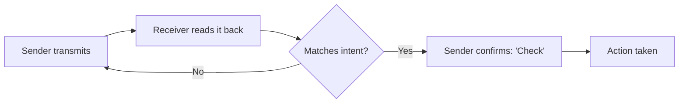
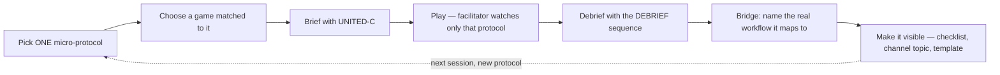
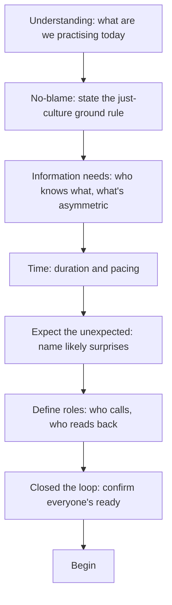
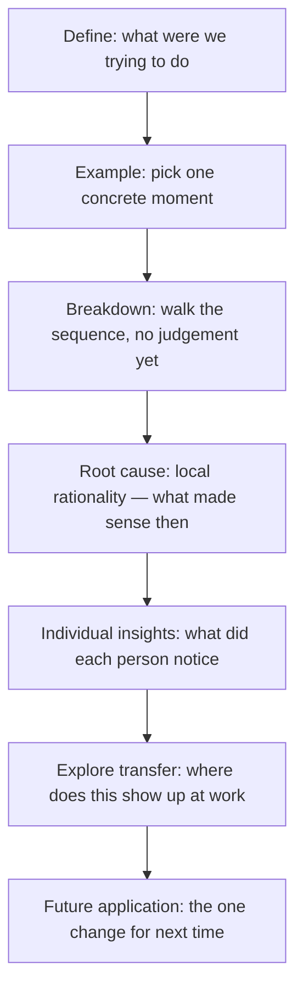

---

This is another completely AI generated post. I'm going to work through it and probably do a bunch of rewriting as I play around with these ideas.

---

This is a working guide for using games — video, tabletop, and DIY — as a low-stakes sandbox for the specific communication habits that make teams reliable under pressure: closed-loop confirmation, shared mental models, and blameless debriefs that separate "the system failed" from "you broke protocol." I'm building it to run with my own team, who mostly ship software and coordinate architectural workflows, but the underlying habits aren't domain-specific, so I've tried to write it for anyone trying to get a team working really well.

**⚠️ Everything in Section 4 is currently unplayed by me.** The mechanics are probably accurate but the protocol/briefing/debrief pairings are AI generated, so I'll update them once we've played it through. As I run sessions, I'll overwrite the "Played?" line on each card and fill in the field notes table underneath it.

  <button id="preview-booklet-btn" type="button">📖 Preview as printable booklet</button>
  

## Contents

1. [Foundations](#foundations)
2. [The Operational Transfer Engine](#the-operational-transfer-engine)
3. [Briefing & Debriefing Frameworks](#briefing--debriefing-frameworks)
4. [The Game Simulation Library](#the-game-simulation-library)
5. [Appendix: Running This For Real](#appendix-running-this-for-real)

---

## Foundations

Three ideas hold this guide up, and none of them are mine originally. I've borrowed them from three fields that spend a lot more time than most of us thinking carefully about how teams fail under pressure, and rebuilt them here as something you can actually run on a Tuesday afternoon with whatever's in the game cupboard.

### 1.1 Games as a low-stakes sandbox

Amy Edmondson's psychological safety research found that the teams which perform best aren't the ones that make the fewest mistakes — they're the ones willing to report the mistakes they make, because the cost of speaking up is lower than the cost of staying quiet.[^edmondson] The problem for most workplaces is that you can't cheaply manufacture the conditions to practise that. A botched code review or a miscommunicated brief has real cost attached, so people default to the safer, quieter option, and the habit of speaking up never gets built.

A 20-minute board game has almost none of that cost. Nobody's annual review depends on whether the submarine gets torpedoed. It's a space where a team can fail loudly, in public, more than once, and treat the failure as information rather than a verdict on anyone's competence. Patrick Lencioni's work on team dysfunction makes the same point from the other direction — an unwillingness to be vulnerable in front of colleagues is usually the first domino, and it's much easier to practise vulnerability over a shared table with cardboard tokens on it than in a live incident retro.[^lencioni]

**The Personal Hazard Brief.** Before playing anything, go around the table and have each person name their own predictable failure mode under pressure — not a personality trait, a specific behaviour. "I go quiet and stop offering information once I think someone else has it handled." "I start giving orders instead of asking questions." "I fixate on the plan I made two minutes ago even after it's clearly wrong." This takes two minutes and changes the whole session: once you've told the group what you're likely to do badly, it stops being a surprise when you do it, and the debrief can refer back to it directly ("*there's the quiet thing you mentioned — what would have helped just then?*").

### 1.2 The mechanics we're trying to train

Human factors research — largely out of aviation, and increasingly out of high-consequence fields like diving, medicine, and process safety — has a fairly compact vocabulary for the specific things that go wrong in team communication. Gareth Lock's work adapting cockpit-derived human factors thinking into sport diving is the clearest recent example of this vocabulary travelling well outside its original industry, and it travels just as well into software and design work.[^lock] Here's the glossary this guide keeps coming back to, with the game library in Section 4 built to isolate each one on purpose.

| Term                                             | What it means                                                                                                                                                                                     |
|--------------------------------------------------|---------------------------------------------------------------------------------------------------------------------------------------------------------------------------------------------------|
| **Closed-loop communication**                    | Sender transmits → receiver repeats it back (read-back) → sender confirms it's correct ("that's right" / "check"). Nothing is assumed heard until it's been said back.                            |
| **Shared mental model**                          | The state where everyone on the team has converged on the same picture of what's happening and what happens next — as opposed to five people quietly running five different versions of the plan. |
| **Sender–receiver pacing**                       | Matching the rate of information transfer to the *receiver's* processing capacity, not the sender's stress level. Panic makes people speak faster and less clearly, which is exactly backwards.   |
| **Callout / speak-up protocol**                  | A standardised word used to interrupt anything immediately — "STOP," "HOLD," "HARD FAULT" — chosen in advance so nobody has to improvise a way to interrupt a colleague mid-flow under stress.    |
| **Signal-to-noise ratio (SNR)**                  | The proportion of a shared channel that's actually load-bearing information, versus chatter, hedging, and narration. Under load, SNR collapses faster than people expect.                         |
| **Confirmation bias / assumption trap**          | Acting on what you *expected* a teammate or manual to say, rather than what they actually said.                                                                                                   |
| **Outcome bias**                                 | Judging a decision by how it turned out rather than by the quality of the reasoning and information available at the time it was made.                                                            |
| **Single-point-of-failure (SPOF) communication** | Relying on one unconfirmed message to carry a high-stakes action, with no redundancy or second check.                                                                                             |

### 1.3 Just culture & local rationality

The single most useful habit in this whole guide is banning one question: **"why did you do that?"** It sounds neutral, but asked after the fact, once you already know how things turned out, it's a leading question — it invites a story about carelessness rather than a description of what actually happened. Sidney Dekker and Todd Conklin's work on Just Culture and local rationality replaces it with a harder, more honest one: **"what did you know, at that exact moment, that made this the right call?"**[^dekker] Every operator, in the moment, is doing what makes sense given their goals, their attention, and the information actually in front of them — even when it turns out to be wrong. The job of a debrief is to reconstruct that local view, not to grade it against information only available in hindsight.

This has a hard boundary that's worth stating explicitly, because "no blame" is often misheard as "no accountability." Local rationality is the lens for *system errors and honest mistakes* — the read-back that got missed because three people were talking at once, the wire cut on a reasonable but wrong guess. It is not a shield for reckless disregard of a known rule, and a good facilitator needs to be able to tell the two apart out loud, in front of the team, or the whole framework curdles into an excuse. The games in Section 4 are chosen because they're honest mistake generators almost by design — nobody sabotages a Pandemic game on purpose — which is exactly why they're a safe place to build the habit before it has to hold up somewhere that matters more.

---

## The Operational Transfer Engine

The single biggest way this kind of exercise fails is trying to fix everything at once: run a chaotic game, have a scattered chat about "communication," and never change anything about how the team actually works on Monday. The fix is to isolate one behaviour, practise it in a 15-minute game, and explicitly bridge it to one real workflow before you finish.

1. **Pick one micro-protocol.** Not five. "Mandatory read-back before any destructive action" is a protocol you can actually watch for and debrief. "Better communication" is not.
2. **Choose a 15–20 minute game matched to it** — every card in Section 4 names its selected micro-protocol so you can pick by target rather than by which game happens to be in the cupboard.
3. **Brief it with UNITED-C** (Section 3) — 3–5 minutes, no longer.
4. **Play, and watch for exactly that one thing.** Resist the urge to coach on unrelated behaviour mid-game; you're building one habit, not auditing the whole team.
5. **Debrief it** with the local-rationality and operational-transfer prompts on the card.
6. **Bridge it, explicitly, before anyone leaves the room.** Name the exact real-world moment this protocol maps to, and write it somewhere the team will actually see again — a line in the PR template, a standing item in the incident-channel topic, a step added to the deploy checklist. A protocol that only exists in a debrief conversation evaporates within a week.

### Transfer bridge recipes

| Sandbox micro-protocol           | Game example                                                                                 | Daily equivalent                                                                       |
|----------------------------------|----------------------------------------------------------------------------------------------|----------------------------------------------------------------------------------------|
| **Mandatory read-back**          | *Keep Talking and Nobody Explodes*: confirming wire colour and position before cutting.      | Reading back a production deploy command or a destructive migration before running it. |
| **Structured escalation (SBAR)** | *Mayday Protocol*: calling out a specific cockpit fault clearly and asking for the fix.      | Raising a production incident: what's broken, what you've tried, what you need.        |
| **Channel cleanliness**          | *Captain Sonar*: the radio operator listens in silence for the enemy's spoken moves.         | Keeping an incident channel free of commentary while triage is live.                   |
| **Pacing & hand-offs**           | *Overcooked! 2*: calling out a station bottleneck before it backs up the whole kitchen.      | Flagging a blocked PR or a stalled handoff before it silently slips a sprint.          |
| **Perspective-taking**           | *Hanabi*: working out what a teammate's hand tells you they can't already see.               | Writing a PR description or a spec for someone who doesn't have your context.          |
| **Consensus over authority**     | *NASA Moon Survival*: reasoning from evidence rather than whoever's most senior in the room. | A design review where the loudest voice and the best argument aren't the same person.  |

---

## Briefing & Debriefing Frameworks

### Pre-brief: UNITED-C

Run this before every session, in order, out loud. It takes three to five minutes and it's the same three to five minutes every time — the value is in it becoming boring and automatic.

|                               |                                                                               |
|-------------------------------|-------------------------------------------------------------------------------|
| **U** — Understanding         | State the one micro-protocol this session is for, in a sentence.              |
| **N** — No-Blame              | Say the just-culture line out loud: "we're debriefing decisions, not people." |
| **I** — Information Needs     | Name what's asymmetric — who can see what the others can't.                   |
| **T** — Time                  | State the duration and any pacing expectations.                               |
| **E** — Expect the Unexpected | Name the kind of surprise the game is likely to throw at them.                |
| **D** — Define Roles          | Who calls, who reads back, who's the tie-breaker.                             |
| **C** — Closed the loop       | A final "everyone clear?" and an actual answer before you start.              |

### SBAR — for escalation

Borrowed straight from clinical handover, and useful anywhere someone needs to interrupt a colleague with a problem without rambling into it:

**S**ituation — what's happening right now, one sentence. **B**ackground — the minimum context needed to understand it. **A**ssessment — what you think is going on. **R**ecommendation — what you need from the other person, specifically.

### I'M SAFE — a personal readiness check

A pilot's pre-flight self-check, useful before any session (or any demanding meeting) where you want people to flag their own state rather than perform through it: **I**llness, **M**edication, **S**tress, **A**lcohol, **F**atigue, **E**ating. You don't need the aviation-specific letters to matter literally — the point is a standing, low-stakes ritual for "am I actually fit to do this well right now," said out loud rather than silently pushed through.

### Debrief: the DEBRIEF sequence

Healthcare simulation training has spent a long time working out how to debrief high-stakes scenarios without it turning into either a blame session or a vague "how did that feel" chat. Zigmont, Kappus, and Sudikoff's Three-Phase model — defusing the emotional reaction first, discovering what happened, then deepening into transfer and principle — is the clearest version of that discipline, and it's the shape underneath the sequence below.[^zigmont]

**D**efine what the objective was. **E**xample — pick one specific moment rather than relitigating the whole session. **B**reakdown the sequence step by step, before anyone's allowed to judge it. **R**oot cause — ask the local-rationality question, not "why." **I**ndividual insights — what did each person notice, feel, or miss that others didn't. **E**xplore transfer — where does this exact failure mode show up at work. **F**uture application — the single change you'll try next time, not a list of five.

### AAR — the four-question version

The military/agile standby, useful when you have five minutes, not twenty: **What was supposed to happen? What actually happened? What went well, and why? What will we do differently?**

---

## The Game Simulation Library

This library exists because of a game called Interlab, which does exactly the job this whole guide is chasing — but it isn't publicly available, so I can't just tell you to go buy it. What follows is my attempt to get a similar effect out of things anyone can actually get hold of: commercial video games, board games, and a few DIY exercises built from scratch. None of it is a perfect substitute, but between all 22 of them there's a reasonable chance of landing close.

Each card below follows the same shape: a facing page for a photo (blank for now — I'll fill these in as I actually run sessions), then the facilitator card itself — what the game is, what human-factors habit it targets, which single micro-protocol to isolate, where to spend the UNITED-C brief, and what to ask in the debrief. Every card is currently flagged **not yet playtested**; the mechanics are checked and accurate, but the protocol pairing is my first guess, not a proven one.

📷 
<strong>I'll add a photo once we've played this</strong> 
<small>(box art / table setup / the team mid-session)</small>

<section class="game-card game-card--dense">

#### 01 — Keep Talking and Nobody Explodes

|                  |                                                 |
|------------------|-------------------------------------------------|
| **Players**      | 1 Defuser + 1–4 Experts                         |
| **Duration**     | 10–15 min per bomb                              |
| **Type**         | Digital (PC/console/mobile/VR)                  |
| **Cost / Setup** | ≈$5–15 depending on platform; no physical setup |
| **HF Target**    | Closed-loop communication                       |
| **Link**         | keeptalkinggame.com                             |
| **Played?**      | Not yet playtested†                             |

† mechanics below are confirmed from the published rules/reviews; the protocol and debrief questions are a first guess, not a field-tested pick.

**Mission:** The Defuser sits alone in front of a virtual bomb they can see but don't understand. The Experts have the printed defusal manual but can't see the bomb at all. Everything has to be described and confirmed out loud before a wire gets cut.

**Micro-Protocol:** Mandatory read-back — the Defuser must describe exactly what they see, and the Expert must confirm exactly what to do, before any action is taken. No cutting on a hunch.

**UNITED-C focus:** Define Roles — be explicit that the Defuser never acts without a confirmed instruction, and the Expert never guesses at what the bomb looks like.

**DEBrIEF prompts:**

- *Local rationality:* "When you cut early, what did you think you'd already confirmed?"
- *Operational transfer:* "Where do we act on an instruction we think we understood, without saying it back first?"

**Field Notes** *(log every time you run this)*

| Date | Team | Worked | Didn't | Adjust next time |
|------|------|--------|--------|------------------|
|      |      |        |        |                  |

</section>

📷 
<strong>I'll add a photo once we've played this</strong> 
<small>(box art / table setup / the team mid-session)</small>

<section class="game-card game-card--dense">

#### 02 — We Were Here (series)

|                  |                                         |
|------------------|-----------------------------------------|
| **Players**      | 2 (strictly asymmetric)                 |
| **Duration**     | 1–3 hrs per entry                       |
| **Type**         | Digital (PC/console)                    |
| **Cost / Setup** | First entry free; later entries ≈$15–20 |
| **HF Target**    | Shared mental models via description    |
| **Link**         | wewereheregame.com                      |
| **Played?**      | Not yet playtested†                     |

† mechanics below are confirmed from the published rules/reviews; the protocol and debrief questions are a first guess, not a field-tested pick.

**Mission:** Two players are physically separated in different rooms of the same puzzle, communicating only by walkie-talkie. Neither can see what the other sees, so the entire game is a test of how precisely you can describe an environment in words.

**Micro-Protocol:** Confirm before acting — describe what you're looking at, and get an explicit "yes, that matches" before either of you touches anything.

**UNITED-C focus:** Information Needs — establish up front that neither player will ever see the other's room, so nothing can be resolved by pointing or looking over a shoulder.

**DEBrIEF prompts:**

- *Local rationality:* "When the description didn't match what I expected, what did I assume instead of asking?"
- *Operational transfer:* "Where do we describe something to a colleague assuming they're picturing what we're picturing?"

**Field Notes** *(log every time you run this)*

| Date | Team | Worked | Didn't | Adjust next time |
|------|------|--------|--------|------------------|
|      |      |        |        |                  |

</section>

📷 
<strong>I'll add a photo once we've played this</strong> 
<small>(box art / table setup / the team mid-session)</small>

<section class="game-card game-card--dense">

#### 03 — Operation: Tango

|                  |                                                        |
|------------------|--------------------------------------------------------|
| **Players**      | 2 (online co-op only)                                  |
| **Duration**     | 4–5 hrs full campaign; can be split into missions      |
| **Type**         | Digital (PC/PS/Xbox/Switch)                            |
| **Cost / Setup** | ≈$20 (one copy — the other joins via free Friend Pass) |
| **HF Target**    | Perspective-taking                                     |
| **Link**         | operationtango.com                                     |
| **Played?**      | Not yet playtested†                                    |

† mechanics below are confirmed from the published rules/reviews; the protocol and debrief questions are a first guess, not a field-tested pick.

**Mission:** One player is Agent Angel, moving through a real 3D world; the other is Alistair, seeing a wireframe network view of the exact same space. Neither view alone is enough — every door, camera, and puzzle requires description from one and action from the other.

**Micro-Protocol:** Named handoff — state clearly whose turn it is to act before acting, so two people never assume the other has already handled it.

**UNITED-C focus:** Information Needs — explicitly name that the two views never overlap, so nothing can be solved by one player alone.

**DEBrIEF prompts:**

- *Local rationality:* "At the moment you acted, what made you think it was your move to make?"
- *Operational transfer:* "Where do two people both assume the other has picked something up?"

**Field Notes** *(log every time you run this)*

| Date | Team | Worked | Didn't | Adjust next time |
|------|------|--------|--------|------------------|
|      |      |        |        |                  |

</section>

📷 
<strong>I'll add a photo once we've played this</strong> 
<small>(box art / table setup / the team mid-session)</small>

<section class="game-card game-card--dense">

#### 04 — Hacktag

|                  |                                             |
|------------------|---------------------------------------------|
| **Players**      | 2 (core co-op mode)                         |
| **Duration**     | 5–6 hrs full campaign; missions run shorter |
| **Type**         | Digital (PC/Steam)                          |
| **Cost / Setup** | ≈$10 per copy — both players need one       |
| **HF Target**    | Trust under mixed incentives                |
| **Link**         | Search "Hacktag" on Steam                   |
| **Played?**      | Not yet playtested†                         |

† mechanics below are confirmed from the published rules/reviews; the protocol and debrief questions are a first guess, not a field-tested pick.

**Mission:** One player is the on-site Agent, moving through a building; the other is the Hacker, remotely controlling cameras and doors from a separate view. Notably "co-opetitive" — the mission is shared, but the two players are also individually scored, which creates a small, deliberate trust wrinkle worth naming.

**Micro-Protocol:** State intent before acting on a shared system — the Hacker calls out what they're about to toggle before toggling it, since an unannounced change can strand the Agent mid-move.

**UNITED-C focus:** No-Blame — this game has a built-in incentive to prioritise your own score; say explicitly that tonight the shared mission outranks the individual one.

**DEBrIEF prompts:**

- *Local rationality:* "When you optimised for your own score, what made that feel like the right call in the moment?"
- *Operational transfer:* "Where do our own incentives quietly compete with the team's, without anyone naming it?"

**Field Notes** *(log every time you run this)*

| Date | Team | Worked | Didn't | Adjust next time |
|------|------|--------|--------|------------------|
|      |      |        |        |                  |

</section>

📷 
<strong>I'll add a photo once we've played this</strong> 
<small>(box art / table setup / the team mid-session)</small>

<section class="game-card game-card--dense">

#### 05 — Spaceteam VR

|                  |                                                   |
|------------------|---------------------------------------------------|
| **Players**      | Up to 6 (VR headsets + phone co-pilots)           |
| **Duration**     | Short, replayable rounds — plan ≈15 min per block |
| **Type**         | VR (SteamVR, Meta Quest)                          |
| **Cost / Setup** | ≈$13–19; needs at least one VR headset            |
| **HF Target**    | Signal-to-noise ratio                             |
| **Link**         | Search "Spaceteam VR" on Steam or Quest store     |
| **Played?**      | Not yet playtested†                               |

† mechanics below are confirmed from the published rules/reviews; the protocol and debrief questions are a first guess, not a field-tested pick.

**Mission:** Every player's control panel shows instructions meant for *someone else's* panel, scrambled at random. Because everyone's in a headset, nobody can glance at another player's screen — the only channel that exists is shouted verbal instruction, under a constant, worsening din.

**Micro-Protocol:** One voice at a time on critical calls — agree in the brief that a genuine emergency callout gets silence from everyone else for the two seconds it takes to land.

**UNITED-C focus:** Expect the Unexpected — warn the team explicitly that the noise will get worse than feels reasonable, on purpose.

**DEBrIEF prompts:**

- *Local rationality:* "When you missed a callout, what else was competing for your attention right then?"
- *Operational transfer:* "Where does our own version of 'everyone shouting at once' show up — all-hands Slack channels, incident bridges?"

**Field Notes** *(log every time you run this)*

| Date | Team | Worked | Didn't | Adjust next time |
|------|------|--------|--------|------------------|
|      |      |        |        |                  |

</section>

📷 
<strong>I'll add a photo once we've played this</strong> 
<small>(box art / table setup / the team mid-session)</small>

<section class="game-card game-card--dense">

#### 06 — Mayday Protocol

|                  |                                                                    |
|------------------|--------------------------------------------------------------------|
| **Players**      | 1 Pilot + 1 or more Co-Pilots                                      |
| **Duration**     | Short missions — budget ≈15–20 min per run (not officially stated) |
| **Type**         | Digital (PC/Steam)                                                 |
| **Cost / Setup** | ≈$8 — only the Pilot needs a copy                                  |
| **HF Target**    | Single-point-of-failure communication                              |
| **Link**         | Search "Mayday Protocol" on Steam                                  |
| **Played?**      | Not yet playtested†                                                |

† mechanics below are confirmed from the published rules/reviews; the protocol and debrief questions are a first guess, not a field-tested pick.

**Mission:** The Pilot faces a cockpit full of failing instruments with no idea how to fix any of them. The Co-Pilot holds the manual but can't see the cockpit. Every fix depends on an accurate description going one way and an accurate instruction coming back.

**Micro-Protocol:** No single unconfirmed instruction gets acted on — the Pilot repeats the fix back before touching anything, closing the same loop KTANE trains, in a different setting.

**UNITED-C focus:** Time — this one rewards speaking clearly under a ticking clock rather than speaking fast; brief that distinction explicitly.

**DEBrIEF prompts:**

- *Local rationality:* "When you skipped the read-back, what made that feel safe to skip in the moment?"
- *Operational transfer:* "Where's our equivalent of a fix we let through on one unconfirmed message?"

**Field Notes** *(log every time you run this)*

| Date | Team | Worked | Didn't | Adjust next time |
|------|------|--------|--------|------------------|
|      |      |        |        |                  |

</section>

📷 
<strong>I'll add a photo once we've played this</strong> 
<small>(box art / table setup / the team mid-session)</small>

<section class="game-card game-card--dense">

#### 07 — Don't Panic! It Is Just Turbulence

|                  |                                                             |
|------------------|-------------------------------------------------------------|
| **Players**      | 2 (Pilot + Air Traffic Controller)                          |
| **Duration**     | Short rounds — plan ≈15 min per run (not officially stated) |
| **Type**         | Digital (PC/Steam)                                          |
| **Cost / Setup** | ≈$8 total                                                   |
| **HF Target**    | Sender–receiver pacing                                      |
| **Link**         | Search "Don't Panic! It Is Just Turbulence" on Steam        |
| **Played?**      | Not yet playtested†                                         |

† mechanics below are confirmed from the published rules/reviews; the protocol and debrief questions are a first guess, not a field-tested pick.

**Mission:** The Pilot sits amid chaotic, failing instruments; the ATC holds cryptic clues that need decoding and relaying. The ATC's job is as much about pacing the information as decoding it — dumping the whole clue at once helps nobody.

**Micro-Protocol:** Chunk it — the ATC delivers one instruction at a time and waits for confirmation before adding the next, instead of relaying the whole clue in one breath.

**UNITED-C focus:** Understanding — spend the brief making sure the ATC knows their job is pacing, not just accuracy.

**DEBrIEF prompts:**

- *Local rationality:* "When you rushed the instruction, what pressure were you responding to?"
- *Operational transfer:* "Where do we dump information on someone faster than they can actually use it?"

**Field Notes** *(log every time you run this)*

| Date | Team | Worked | Didn't | Adjust next time |
|------|------|--------|--------|------------------|
|      |      |        |        |                  |

</section>

📷 
<strong>I'll add a photo once we've played this</strong> 
<small>(box art / table setup / the team mid-session)</small>

<section class="game-card game-card--dense">

#### 08 — Affordable Space Adventures

|                  |                                                                  |
|------------------|------------------------------------------------------------------|
| **Players**      | Up to 3 (asymmetric roles)                                       |
| **Duration**     | Session-length, split into short exploration bursts              |
| **Type**         | Digital (Wii U only)                                             |
| **Cost / Setup** | ≈$20 — **Wii U eShop closed in 2023; secondhand cartridge only** |
| **HF Target**    | Task saturation & role division                                  |
| **Link**         | n/a — check secondhand marketplaces                              |
| **Played?**      | Not yet playtested†                                              |

† mechanics below are confirmed from the published rules/reviews; the protocol and debrief questions are a first guess, not a field-tested pick. Note the availability caveat above before planning a session around this one.

**Mission:** One player (GamePad) manages the ship's systems in real time, while one or two others (Wii Remote) pilot and scan. Each role controls a different, non-overlapping system of one shared vehicle — nobody has the full picture, and the ship only moves correctly if all three keep talking continuously.

**Micro-Protocol:** Running commentary, not just callouts — the pilot narrates intent continuously ("descending now," "about to bank left") rather than waiting for something to go wrong before speaking.

**UNITED-C focus:** Define Roles — be explicit that no one role can see enough to compensate for the others going quiet.

**DEBrIEF prompts:**

- *Local rationality:* "When you stopped narrating, what made you think the others already knew?"
- *Operational transfer:* "Where do we go quiet because we assume our status is obvious to everyone else?"

**Field Notes** *(log every time you run this)*

| Date | Team | Worked | Didn't | Adjust next time |
|------|------|--------|--------|------------------|
|      |      |        |        |                  |

</section>

📷 
<strong>I'll add a photo once we've played this</strong> 
<small>(box art / table setup / the team mid-session)</small>

<section class="game-card game-card--dense">

#### 09 — Overcooked! 2

|                  |                                                 |
|------------------|-------------------------------------------------|
| **Players**      | 2–4                                             |
| **Duration**     | 15–20 min per level                             |
| **Type**         | Digital (PC/console)                            |
| **Cost / Setup** | ≈$25, no physical prep                          |
| **HF Target**    | Pacing & hand-offs                              |
| **Link**         | Search "Overcooked! 2" on your platform's store |
| **Played?**      | Not yet playtested†                             |

† mechanics below are confirmed from the published rules/reviews; the protocol and debrief questions are a first guess, not a field-tested pick.

**Mission:** A shared kitchen under a ticking timer, with stations that inevitably bottleneck. Everyone can see the whole kitchen, so this one isn't about hidden information — it's about calling a problem out *before* it backs up the whole line.

**Micro-Protocol:** Early callout — the moment you notice a bottleneck forming, say so out loud, before it's already a crisis.

**UNITED-C focus:** Expect the Unexpected — name that orders will spike faster than feels fair, and that's the point.

**DEBrIEF prompts:**

- *Local rationality:* "When the bottleneck built up, what were you doing instead of calling it?"
- *Operational transfer:* "Where does a stalled handoff sit quietly until it costs a whole sprint?"

**Field Notes** *(log every time you run this)*

| Date | Team | Worked | Didn't | Adjust next time |
|------|------|--------|--------|------------------|
|      |      |        |        |                  |

</section>

📷 
<strong>I'll add a photo once we've played this</strong> 
<small>(box art / table setup / the team mid-session)</small>

<section class="game-card game-card--dense">

#### 10 — Spaceteam (mobile / card game)

|                  |                                                   |
|------------------|---------------------------------------------------|
| **Players**      | Up to 4 (mobile app) or similar (card game)       |
| **Duration**     | 3–5 min per round, endlessly replayable           |
| **Type**         | Mobile app (free) or physical card game (≈$15–20) |
| **Cost / Setup** | Free–$20 depending on version                     |
| **HF Target**    | Callout / speak-up protocol                       |
| **Link**         | spaceteam.ca                                      |
| **Played?**      | Not yet playtested†                               |

† mechanics below are confirmed from the published rules/reviews; the protocol and debrief questions are a first guess, not a field-tested pick.

**Mission:** The original chaos party game — each player's console shows instructions for a control that's actually on someone else's panel, invented gibberish names and all. Everyone must shout what they see and act on what they hear before the whole ship falls apart.

**Micro-Protocol:** Name the panel, then the action — a callout is only useful if it's specific enough for the right person to recognise it's meant for them.

**UNITED-C focus:** No-Blame — say up front that shouting badly is expected and not a performance failure; it's the whole mechanic.

**DEBrIEF prompts:**

- *Local rationality:* "When a callout got lost, what else were you listening to at that moment?"
- *Operational transfer:* "Where do we send an instruction into a shared channel vague enough that nobody's sure it was meant for them?"

**Field Notes** *(log every time you run this)*

| Date | Team | Worked | Didn't | Adjust next time |
|------|------|--------|--------|------------------|
|      |      |        |        |                  |

</section>

📷 
<strong>I'll add a photo once we've played this</strong> 
<small>(box art / table setup / the team mid-session)</small>

<section class="game-card game-card--dense">

#### 11 — Decrypto

|                  |                                      |
|------------------|--------------------------------------|
| **Players**      | 4–8 (2 teams)                        |
| **Duration**     | 20–30 min                            |
| **Type**         | Board Game                           |
| **Cost / Setup** | ≈$25, no prep                        |
| **HF Target**    | Shared mental models under ambiguity |
| **Link**         | Search "Decrypto" board game         |
| **Played?**      | Not yet playtested†                  |

† mechanics below are confirmed from the published rules/reviews; the protocol and debrief questions are a first guess, not a field-tested pick.

**Mission:** Two teams each guess a private 4-digit code from one-word clues given by their own clue-giver, while the opposing team listens in trying to intercept the same code.

**Micro-Protocol:** Mandatory clue confirmation — before locking a guess, the team says back what they think the clue points to and gets a yes/no from the clue-giver.

**UNITED-C focus:** Information Needs — what does my teammate actually know that I don't?

**DEBrIEF prompts:**

- *Local rationality:* "What did that clue mean to you in the moment, before you knew the answer?"
- *Operational transfer:* "Where at work do we guess at what a message meant instead of confirming it?"

**Field Notes** *(log every time you run this)*

| Date | Team | Worked | Didn't | Adjust next time |
|------|------|--------|--------|------------------|
|      |      |        |        |                  |

</section>

📷 
<strong>I'll add a photo once we've played this</strong> 
<small>(box art / table setup / the team mid-session)</small>

<section class="game-card game-card--dense">

#### 12 — The Mind

|                  |                                                  |
|------------------|--------------------------------------------------|
| **Players**      | 2–4                                              |
| **Duration**     | ≈20 min                                          |
| **Type**         | Card Game                                        |
| **Cost / Setup** | ≈$15, no prep                                    |
| **HF Target**    | Implicit shared mental models (the control case) |
| **Link**         | Search "The Mind" card game                      |
| **Played?**      | Not yet playtested†                              |

† mechanics below are confirmed from the published rules/reviews; the protocol and debrief questions are a first guess, not a field-tested pick.

**Mission:** The team must play numbered cards in ascending order across the whole group — with zero communication allowed, verbal or gestural. It's the deliberate inverse of every other card in this library, and worth running precisely because of that: it isolates how much coordination happens through shared timing and attention alone, with no channel at all.

**Micro-Protocol:** A 30-second silent pause after each round before anyone speaks — noticing your own instinct before it gets overwritten by the group's story about what happened.

**UNITED-C focus:** Understanding — be explicit that this round has no communication channel at all, on purpose, so nobody tries to cheat it with a cough or a glance.

**DEBrIEF prompts:**

- *Local rationality:* "With no channel available, what were you actually using to decide when to play?"
- *Operational transfer:* "Where do we coordinate successfully without ever actually saying the plan out loud — and is that a strength or a risk?"

**Field Notes** *(log every time you run this)*

| Date | Team | Worked | Didn't | Adjust next time |
|------|------|--------|--------|------------------|
|      |      |        |        |                  |

</section>

📷 
<strong>I'll add a photo once we've played this</strong> 
<small>(box art / table setup / the team mid-session)</small>

<section class="game-card game-card--dense">

#### 13 — Captain Sonar

|                  |                                                         |
|------------------|---------------------------------------------------------|
| **Players**      | 2 teams of up to 4 (8 total)                            |
| **Duration**     | 30–45 min                                               |
| **Type**         | Board Game (real-time)                                  |
| **Cost / Setup** | ≈$50, ≈5 min setup                                      |
| **HF Target**    | Closed-loop role communication under real-time pressure |
| **Link**         | Search "Captain Sonar" board game                       |
| **Played?**      | Not yet playtested†                                     |

† mechanics below are confirmed from the published rules/reviews; the protocol and debrief questions are a first guess, not a field-tested pick.

**Mission:** Four roles per team — Captain, First Mate, Engineer, Radio Operator — run a submarine in real time, simultaneously, against an opposing crew. The Radio Operator's entire job is listening in silence for the enemy's spoken moves and triangulating their position from it: channel discipline as a literal, scored mechanic.

**Micro-Protocol:** Role-locked callouts — each role only speaks their own information, in their own format, so the Radio Operator's channel stays clean enough to actually hear the enemy.

**UNITED-C focus:** Define Roles — this game collapses immediately if the Captain starts doing the Engineer's job out loud.

**DEBrIEF prompts:**

- *Local rationality:* "When the channel got noisy, what made you decide to jump in anyway?"
- *Operational transfer:* "Where does one role's chatter drown out the one channel that actually needed to be quiet?"

**Field Notes** *(log every time you run this)*

| Date | Team | Worked | Didn't | Adjust next time |
|------|------|--------|--------|------------------|
|      |      |        |        |                  |

</section>

📷 
<strong>I'll add a photo once we've played this</strong> 
<small>(box art / table setup / the team mid-session)</small>

<section class="game-card game-card--dense">

#### 14 — Hanabi

|                  |                           |
|------------------|---------------------------|
| **Players**      | 2–5                       |
| **Duration**     | 25–30 min                 |
| **Type**         | Card Game                 |
| **Cost / Setup** | ≈$15, no prep             |
| **HF Target**    | Perspective-taking        |
| **Link**         | Search "Hanabi" card game |
| **Played?**      | Not yet playtested†       |

† mechanics below are confirmed from the published rules/reviews; the protocol and debrief questions are a first guess, not a field-tested pick.

**Mission:** Everyone can see everyone else's hand except their own, and clues are limited and costly. Every clue you give has to be chosen based on a model of what the *other* player already knows — a clean, repeatable theory-of-mind exercise.

**Micro-Protocol:** Before giving a clue, say (internally or out loud in a debrief pause) what you think the receiver already knows — not just what's true.

**UNITED-C focus:** Information Needs — the entire game is about modelling what someone else lacks, not what you know.

**DEBrIEF prompts:**

- *Local rationality:* "When that clue didn't land, what did you think they already knew?"
- *Operational transfer:* "Where do we write a spec or a PR description assuming context the reader doesn't actually have?"

**Field Notes** *(log every time you run this)*

| Date | Team | Worked | Didn't | Adjust next time |
|------|------|--------|--------|------------------|
|      |      |        |        |                  |

</section>

📷 
<strong>I'll add a photo once we've played this</strong> 
<small>(box art / table setup / the team mid-session)</small>

<section class="game-card game-card--dense">

#### 15 — Just One

|                  |                                     |
|------------------|-------------------------------------|
| **Players**      | 3–7                                 |
| **Duration**     | ≈20 min                             |
| **Type**         | Board Game                          |
| **Cost / Setup** | ≈$18, no prep                       |
| **HF Target**    | Assumption trap / confirmation bias |
| **Link**         | Search "Just One" board game        |
| **Played?**      | Not yet playtested†                 |

† mechanics below are confirmed from the published rules/reviews; the protocol and debrief questions are a first guess, not a field-tested pick.

**Mission:** Everyone writes a one-word clue to help one player guess a secret word — but any clue duplicated by another player gets silently removed before the guesser sees it. Assuming your teammates will think differently to you is the entire game.

**Micro-Protocol:** No pre-discussion, no peeking — the exercise only works if everyone commits to their own clue without checking what the room already thinks is "the obvious one."

**UNITED-C focus:** Expect the Unexpected — warn the team that the safest, most obvious clue is usually the one that gets cancelled out.

**DEBrIEF prompts:**

- *Local rationality:* "When your clue got cancelled, what made you think it was safely unique?"
- *Operational transfer:* "Where do we all quietly assume someone else has already covered the obvious thing?"

**Field Notes** *(log every time you run this)*

| Date | Team | Worked | Didn't | Adjust next time |
|------|------|--------|--------|------------------|
|      |      |        |        |                  |

</section>

📷 
<strong>I'll add a photo once we've played this</strong> 
<small>(box art / table setup / the team mid-session)</small>

<section class="game-card game-card--dense">

#### 16 — Space Alert

|                  |                                                        |
|------------------|--------------------------------------------------------|
| **Players**      | 1–5                                                    |
| **Duration**     | 45–60 min including the built-in resolution phase      |
| **Type**         | Board Game (with audio track)                          |
| **Cost / Setup** | ≈$45; needs the audio track playable from an app or CD |
| **HF Target**    | Task saturation under a hard deadline                  |
| **Link**         | Search "Space Alert" board game                        |
| **Played?**      | Not yet playtested†                                    |

† mechanics below are confirmed from the published rules/reviews; the protocol and debrief questions are a first guess, not a field-tested pick.

**Mission:** A timed audio track announces threats in real time while the crew plans a full sequence of actions they then execute blind, all at once, in a following resolution phase. It's one of the few games with a genuine built-in debrief mechanic — the resolution phase *is* a structured "what actually happened" replay.

**Micro-Protocol:** Plan out loud, in order, before the clock runs out — a silent plan is a plan nobody else can catch an error in.

**UNITED-C focus:** Time — this is the clearest possible demonstration of planning against a deadline that will not move for you.

**DEBrIEF prompts:**

- *Local rationality:* "When the plan fell apart, what did you think you had time for?"
- *Operational transfer:* "Where do we plan silently under a deadline instead of narrating the plan so someone can catch the gap?"

**Field Notes** *(log every time you run this)*

| Date | Team | Worked | Didn't | Adjust next time |
|------|------|--------|--------|------------------|
|      |      |        |        |                  |

</section>

📷 
<strong>I'll add a photo once we've played this</strong> 
<small>(box art / table setup / the team mid-session)</small>

<section class="game-card game-card--dense">

#### 17 — Pandemic

|                  |                              |
|------------------|------------------------------|
| **Players**      | 2–4                          |
| **Duration**     | ≈45 min                      |
| **Type**         | Board Game                   |
| **Cost / Setup** | ≈$40, ≈5 min setup           |
| **HF Target**    | Outcome bias                 |
| **Link**         | Search "Pandemic" board game |
| **Played?**      | Not yet playtested†          |

† mechanics below are confirmed from the published rules/reviews; the protocol and debrief questions are a first guess, not a field-tested pick.

**Mission:** A cooperative game against global disease outbreaks, with enough randomness in the card draws that a well-played game can still be lost. That's exactly what makes it useful: it's a clean, repeatable demonstration that a bad outcome doesn't automatically mean a bad decision.

**Micro-Protocol:** After any loss, name the decision *and* the information available at the time, separately, before anyone's allowed to say what they'd do differently.

**UNITED-C focus:** No-Blame — pre-commit, before playing, to debriefing this one on process, not on the final board state.

**DEBrIEF prompts:**

- *Local rationality:* "At the moment of that decision, what did the cards actually tell you — not what you know now?"
- *Operational transfer:* "Where do we judge a call at work by how it turned out rather than what was knowable when it was made?"

**Field Notes** *(log every time you run this)*

| Date | Team | Worked | Didn't | Adjust next time |
|------|------|--------|--------|------------------|
|      |      |        |        |                  |

</section>

📷 
<strong>I'll add a photo once we've played this</strong> 
<small>(box art / table setup / the team mid-session)</small>

<section class="game-card game-card--dense">

#### 18 — NASA Moon Survival / Desert Survival

|                  |                                              |
|------------------|----------------------------------------------|
| **Players**      | Groups of 4–6                                |
| **Duration**     | 30–45 min total                              |
| **Type**         | Experiential (free worksheet exercise)       |
| **Cost / Setup** | Free — printable worksheets widely available |
| **HF Target**    | Consensus-building vs groupthink             |
| **Link**         | Search "NASA Moon Survival exercise"         |
| **Played?**      | Not yet playtested†                          |

† mechanics below are confirmed from the published rules/reviews; the protocol and debrief questions are a first guess, not a field-tested pick.

**Mission:** Each person ranks ≈15 survival items alone, then the group re-ranks them by consensus, and both rankings are scored against an expert answer. Unlike most of this library, there's no hidden information at all — the entire test is whether reasoned argument beats seniority or confidence in the room.

**Micro-Protocol:** Argue from reasoning, not rank — every proposed ranking has to come with a stated reason before the group can accept or reject it.

**UNITED-C focus:** No-Blame — name explicitly that the group score usually beats the best individual score, and that's the point of running it as a group at all.

**DEBrIEF prompts:**

- *Local rationality:* "When the group overrode your ranking, what reasoning actually changed your mind — or didn't?"
- *Operational transfer:* "Where does the most senior voice in the room win an argument it didn't actually make?"

**Field Notes** *(log every time you run this)*

| Date | Team | Worked | Didn't | Adjust next time |
|------|------|--------|--------|------------------|
|      |      |        |        |                  |

</section>

📷 
<strong>I'll add a photo once we've played this</strong> 
<small>(box art / table setup / the team mid-session)</small>

<section class="game-card game-card--dense">

#### 19 — Friday Night at the ER

|                  |                                                                    |
|------------------|--------------------------------------------------------------------|
| **Players**      | 4 per board (one department each)                                  |
| **Duration**     | ≈75 min play + ≈90 min facilitated debrief                         |
| **Type**         | System Dynamics simulation (physical or vFNER online)              |
| **Cost / Setup** | Licensed institutional kit — quote-only via fridaynightattheer.com |
| **HF Target**    | Cross-team information visibility                                  |
| **Link**         | fridaynightattheer.com                                             |
| **Played?**      | Not yet playtested†                                                |

† mechanics below are confirmed from the published rules/reviews; the protocol and debrief questions are a first guess, not a field-tested pick. This is the heaviest item in the library — budget a half-day, and note the cost is quote-based rather than a shelf price.

**Mission:** Four players each manage one hospital department — Emergency, Surgery, Critical Care, Step Down — with a shared patient flow none of them can see in full. It's a system-dynamics exercise before it's a communication one: most bottlenecks turn out to be caused upstream of the department that visibly struggles.

**Micro-Protocol:** State your queue out loud on a fixed cadence, whether or not it's currently a problem — visibility has to be proactive, because by the time a department is asking for help, the backlog is already systemic.

**UNITED-C focus:** Information Needs — be explicit that no single role can see the whole system, and the debrief will focus on that gap specifically.

**DEBrIEF prompts:**

- *Local rationality:* "From your department's view alone, when did this actually start looking like a problem?"
- *Operational transfer:* "Where in our own workflow does a bottleneck get blamed on the team where it becomes visible, rather than the team where it started?"

**Field Notes** *(log every time you run this)*

| Date | Team | Worked | Didn't | Adjust next time |
|------|------|--------|--------|------------------|
|      |      |        |        |                  |

</section>

📷 
<strong>I'll add a photo once we've played this</strong> 
<small>(the actual rig, once you've built one)</small>

<section class="game-card game-card--dense">

#### 20 — The Circuit / Box Wiring Lab (DIY)

|                  |                                                |
|------------------|------------------------------------------------|
| **Players**      | 2 (Technician + Engineer)                      |
| **Duration**     | 15–20 min per fault                            |
| **Type**         | DIY Hardware                                   |
| **Cost / Setup** | ≈$20 in parts; ≈30 min to build once, reusable |
| **HF Target**    | Closed-loop communication (physical/tactile)   |
| **Link**         | n/a — build it yourself, see setup below       |
| **Played?**      | Not yet playtested†                            |

† this is a design, not a commercial product — treat the whole card as a first-draft build, not a proven one.

**Mission:** A physical, reusable answer to KTANE. Build a simple breadboard circuit (a few LEDs, switches, and a buzzer, wired with coloured jumper wires) inside a lidded box, then deliberately mis-wire it. The Technician can touch the box but has no manual; the Engineer holds the correct wiring diagram but can't see or touch it. No electronics skill needed for a lower-fidelity version: swap the breadboard for a labelled junction board and coloured ribbon standing in for wires, worked from a printed diagram.

**Micro-Protocol:** Mandatory read-back before touching a wire — identical in shape to the KTANE protocol, but now with a physical object instead of a screen, which changes the pacing in a way worth debriefing on its own.

**UNITED-C focus:** Define Roles — say clearly the Technician never moves a wire without a confirmed instruction from the Engineer.

**DEBrIEF prompts:**

- *Local rationality:* "When you moved a wire without waiting for confirmation, what made that feel safe enough to skip?"
- *Operational transfer:* "Where does the physical, tactile version of this feel different to doing it over Slack or a call — and what does that tell us about which channel we default to?"

**Field Notes** *(log every time you run this)*

| Date | Team | Worked | Didn't | Adjust next time |
|------|------|--------|--------|------------------|
|      |      |        |        |                  |

</section>

📷 
<strong>I'll add a photo once we've played this</strong> 
<small>(the build, once you've made one)</small>

<section class="game-card game-card--dense">

#### 21 — Cad-to-Lego / Tangrams (DIY)

|                  |                                                  |
|------------------|--------------------------------------------------|
| **Players**      | 2 (Describer + Builder)                          |
| **Duration**     | 10–15 min per structure                          |
| **Type**         | DIY Spatial                                      |
| **Cost / Setup** | A box of Lego or tangram pieces; no other cost   |
| **HF Target**    | Shared mental models via indirect representation |
| **Link**         | n/a — see setup below                            |
| **Played?**      | Not yet playtested†                              |

† this is a design, not a commercial product — treat the whole card as a first-draft build, not a proven one.

**Mission:** Build a small structure and photograph or sketch it in the flat, orthographic style a CAD drawing or a set of assembly instructions would use — the same translation step a spec or a drawing set asks of anyone building from it. The Describer has the drawing (not the model); the Builder has an identical set of pieces but never sees the drawing directly, only what the Describer says about it. Run it as a relay with a third person for a version that also tests information decay: Describer to Relay to Builder, nobody skipping a link.

**Micro-Protocol:** Describe the relationship, not just the piece — "the red brick sits on top of the blue one, offset one stud to the left," not just "put a red brick somewhere."

**UNITED-C focus:** Information Needs — say explicitly that the Builder never sees the drawing, only the words describing it, which is the exact position a contractor or a junior dev is often in.

**DEBrIEF prompts:**

- *Local rationality:* "When the build diverged from the drawing, what did the words actually tell you, versus what you filled in yourself?"
- *Operational transfer:* "Where do we hand someone a description of a thing rather than the thing itself, and assume it survived the translation?"

**Field Notes** *(log every time you run this)*

| Date | Team | Worked | Didn't | Adjust next time |
|------|------|--------|--------|------------------|
|      |      |        |        |                  |

</section>

📷 
<strong>I'll add a photo once we've played this</strong> 
<small>(the course, once you've set one up)</small>

<section class="game-card game-card--dense">

#### 22 — Blindfolded Navigation Protocol (DIY)

|                  |                                                    |
|------------------|----------------------------------------------------|
| **Players**      | 3 (Navigator, Guide, and a deliberate Noise role)  |
| **Duration**     | 10–15 min per run                                  |
| **Type**         | DIY Tactical                                       |
| **Cost / Setup** | A blindfold, some cones or chairs; no other cost   |
| **HF Target**    | Callout / speak-up protocol under deliberate noise |
| **Link**         | n/a — see setup below                              |
| **Played?**      | Not yet playtested†                                |

† this is a design, not a commercial product — treat the whole card as a first-draft build, not a proven one.

**Mission:** One blindfolded person navigates a simple obstacle course using only verbal directions from a Guide. A third person, the Noise role, is briefed in advance to inject distracting or slightly conflicting commentary — not sabotage, just the kind of low-value chatter a busy channel actually carries. The exercise only works if a genuine hazard callout ("STOP") is instantly distinguishable from the noise.

**Micro-Protocol:** One reserved word for a genuine stop — agree it in the brief, and agree that it overrides every other voice in the room, no exceptions, the moment it's said.

**UNITED-C focus:** Define Roles — the Noise role has to be briefed privately beforehand so the Navigator's confusion is genuine, not performed.

**DEBrIEF prompts:**

- *Local rationality:* "When you couldn't tell the real instruction from the noise, what were you using to decide which to trust?"
- *Operational transfer:* "Where does a genuine 'stop what you're doing' get lost in the normal volume of a busy channel?"

**Field Notes** *(log every time you run this)*

| Date | Team | Worked | Didn't | Adjust next time |
|------|------|--------|--------|------------------|
|      |      |        |        |                  |

</section>

---

## Appendix: Running This For Real

### Facilitator Observation Log

Keep one row per session. This is the raw material for noticing patterns across games rather than judging any single run.

| Date | Game | Micro-Protocol Practised | Closed-loop success (est. %) | Assumption gaps noticed | Noise level (1–5) | Notes |
|------|------|--------------------------|------------------------------|-------------------------|-------------------|-------|
|      |      |                          |                              |                         |                   |       |
|      |      |                          |                              |                         |                   |       |
|      |      |                          |                              |                         |                   |       |

### Facilitator troubleshooting

**The Alpha Dominant / Quarterback.** One player takes over, dictates every call, talks over the room. Inject a mid-game constraint — "you can only speak in response to a direct question" — or take it straight to the debrief: "how did one person calling everything change what the rest of us actually knew?"

**The defensive or frustrated player.** Someone bristles when a mistake comes up in debrief. Pivot immediately to local rationality: "let's set the outcome aside — what did you actually have to work with, at the exact second you made that call?" Never let the room re-litigate the outcome once this question is on the table.

**The silent, disengaged participant.** Someone goes quiet under pressure and stops calling things out. If it was named in the Personal Hazard Brief, refer back to it directly: "you mentioned you go quiet under load — what would the team need to do right now to make that easier?" If it wasn't named, that's worth raising gently afterward, not mid-session.

### Printable quick-reference card

The two blocks below are sized to print as a front and back — the booklet preview button will paginate them onto their own final pages.

**FRONT — Pre-brief: UNITED-C**

U — Understanding · N — No-Blame · I — Information Needs · T — Time · E — Expect the Unexpected · D — Define Roles · C — Closed the loop

**Callout vocabulary (agree these before you need them):**
STOP — everyone stops now. HOLD — pause, don't proceed. HARD FAULT — something is actually broken, not just unclear.

**BACK — Debrief: DEBRIEF**

Define · Example · Breakdown · Root cause (local rationality, not outcome) · Individual insights · Explore transfer · Future application (pick one)

**The banned question:** "Why did you do that?"
**The question that replaces it:** "What did you know, right then, that made this the right call?"

---

[^edmondson]: Edmondson, A. C. (1999). Psychological safety and learning behavior in work teams. *Administrative Science Quarterly, 44*(2), 350–383. The core finding: teams that report *more* errors aren't worse teams — they're teams where reporting an error is safe enough to actually happen. The original study came out of hospital nursing units, comparing team-level error rates against independent observer ratings of team performance — the counterintuitive result was that the highest-performing units had the highest *reported* error rates, which only made sense once Edmondson realised she was measuring reporting behaviour, not the underlying error rate itself. Her later book, *The Fearless Organization* (2019), is the more accessible version of the argument if this footnote is as far down the citation trail as you want to go. One thing worth being precise about, since it gets flattened in most corporate retellings: psychological safety isn't the same as being nice, or conflict-averse. Edmondson pairs it explicitly with a second axis — standards, or accountability — and argues a team needs both. Safety without standards just produces a comfortable team that doesn't improve, which is exactly the failure mode a facilitator running this guide should be watching for.

[^lencioni]: Lencioni, P. (2002). *The five dysfunctions of a team: A leadership fable*. Jossey-Bass. The first dysfunction on his list is absence of trust, specifically the unwillingness to be vulnerable within the group — everything else in his model is downstream of that one. The full pyramid runs trust, then fear of conflict, then lack of commitment, then avoidance of accountability, then inattention to results, each one built directly on the one beneath it: a team that can't be vulnerable with each other won't argue honestly, a team that doesn't argue honestly won't actually commit to a decision, and so on up the stack. Worth flagging plainly: this is a business fable, not a research study in the way Edmondson's paper above is — Lencioni built the model from consulting experience rather than a measured dataset, and it's popular precisely because it's memorable and prescriptive rather than because it's been independently validated the way the psychological safety literature has. The distinction that matters most for this guide is the kind of trust he means: not predictive trust, believing a colleague is competent and will do what they say, but vulnerability-based trust, believing you can admit a weakness or a mistake to them without it being used against you later. It's the second kind these games are actually built to practise.

[^lock]: Lock, G. (2019). *Under Pressure: A Guide to Managing Human Factors in Diving*. Ockham Publishing. Lock's work adapts cockpit-derived crew resource management thinking for recreational and technical diving, and is a good template for how far outside its origin industry this vocabulary actually travels. Crew Resource Management itself dates to a late-1970s NASA workshop convened after a string of airline accidents — United 173, most famously — in which the technical flying was fine but the crew failed to communicate clearly enough to catch a fatal problem in time; the entire discipline exists because investigators kept finding that the missing ingredient in these accidents was never stick-and-rudder skill, it was communication under status asymmetry, junior crew not challenging senior crew clearly enough. Lock runs this forward through his Human Diver project and podcast, which is where most of the diving-specific material in this footnote's parent paragraph is drawn from. Diving turns out to be an unusually good bridge domain for a guide aimed at software and design teams, for a reason that has nothing to do with water: like most software teams and unlike a cockpit or an operating theatre, dive teams are usually amateur or semi-professional, mixed-experience, and assembled ad hoc rather than trained together for years — which is closer to how most of our teams actually form.

[^dekker]: Dekker, S. (2016). *Just Culture: Restoring Trust and Accountability in Your Organization* (3rd ed.). CRC Press. See also Conklin, T. (2012). *Pre-Accident Investigations: An Introduction to Organizational Safety*. Ashgate. Local rationality is the shared thread between both: every actor's behaviour made sense to them, given their goals, knowledge, and attention, at the time — hindsight is the thing that has to be actively corrected for, not assumed away. Dekker writes from an unusual vantage point for this literature: a former airline pilot turned safety science professor, which is probably why his version of the argument reads less like management theory and more like an accident investigator's field notes. He's best known for framing what he calls the old view versus the new view of human error — the old view treats error as a cause you can find and remove by disciplining or retraining the person who made it; the new view treats error as a symptom, a signal pointing at a deeper mismatch between the system, the task, and the person, which is where the actual fix lives. The practical tool worth stealing for a debrief is his substitution test: would another equally competent, equally trained person, given exactly the same information and pressures, plausibly have done the same thing? If yes, this isn't a case for blaming the individual, whatever the outcome turned out to be — it's a case for fixing the conditions that made the choice look reasonable.

[^zigmont]: Zigmont, J. J., Kappus, L. J., & Sudikoff, S. N. (2011). The 3D model of debriefing: Defusing, discovering, deepening. *Seminars in Perinatology, 35*(2), 52–58.

